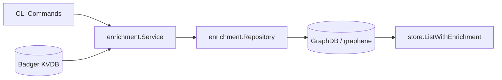
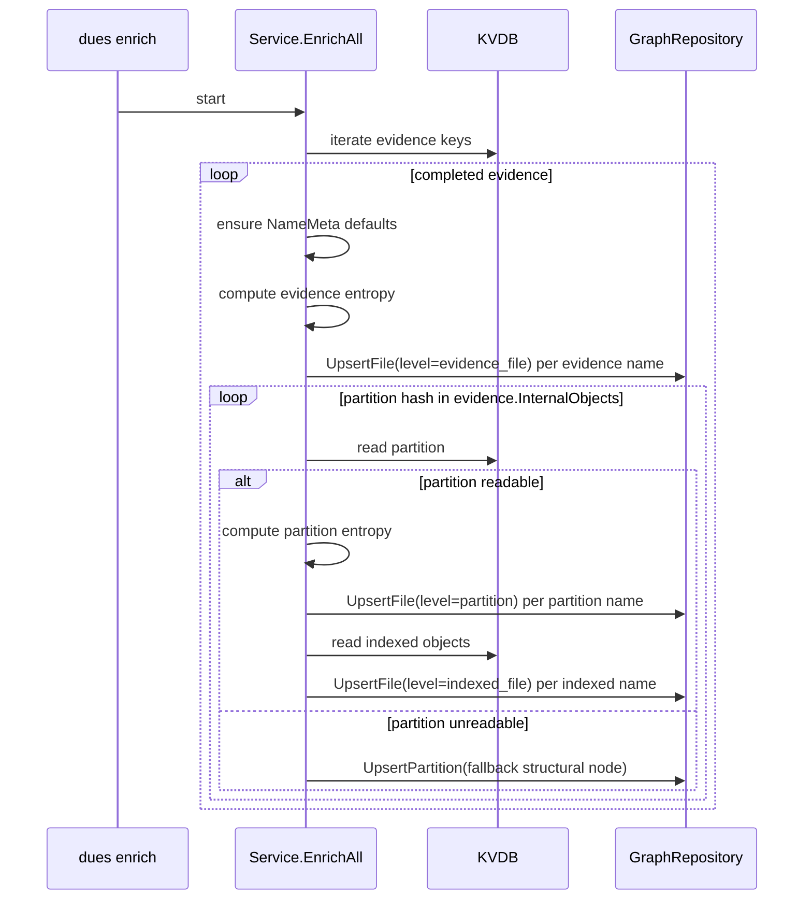
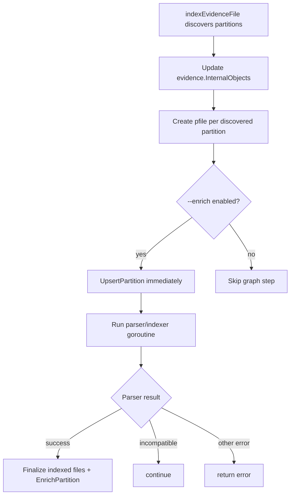
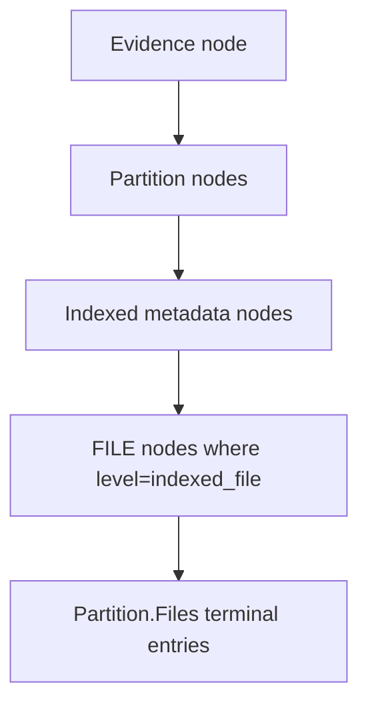

# Enrichment LLD (Low-Level Design)

## 0) One-Page Summary

### 0.1 Purpose

Enrichment converts compact KV objects into explicit GraphDB knowledge nodes so
runtime queries can answer file-level questions quickly and consistently.

### 0.2 Design Principles

1. KVDB optimizes storage layout.
2. GraphDB optimizes information layout.
3. One file name or path means one FILE node.
4. Name-level metadata (`is_deleted`, `is_fragmented`) stays at FILE node.
5. Shared metadata can be duplicated onto each FILE node for query simplicity.
6. Different names may legitimately share the same hash and stay separate nodes.

### 0.3 Mandatory Node Parity Rule

1. If a partition is discovered during store path, that partition must exist in
   GraphDB even if parsing or indexing fails.
2. Partition node presence is not allowed to depend on parser success.

### 0.4 Main Paths

1. Full enrichment command path: `dues enrich`.
2. Store-time incremental path: `dues store --enrich`.

### 0.5 Main Files

1. `lib/enrichment/service.go`
2. `lib/enrichment/graphene_repository.go`
3. `lib/enrichment/types.go`
4. `lib/enrichment/repository.go`
5. `lib/enrichment/tags.go`
6. `cli/cmdenrich.go`
7. `cli/cmdstore.go`

---

## 1) Scope

Included:

1. Enrichment service orchestration and write semantics.
2. Graph schema and upsert behavior.
3. Read projection behavior used by enriched list path.
4. Partition parity guarantees in store-time enrich flow.
5. Entropy, MIME, and tag enrichment behavior.

Not included:

1. Parser internals for filesystem extraction.
2. Micro-artefact detector internals.
3. Search ranking internals.

---

## 2) Architecture

### 2.1 Component Diagram

### 2.2 Runtime Modes

1. Full sweep mode
   - Trigger: `dues enrich`
   - Entry: `Service.EnrichAll()`
   - Reads all completed evidence from KV and populates graph.

2. Incremental store mode
   - Trigger: `dues store --enrich`
   - Entries:
     - `cli/cmdstore.go` store flow
     - parser finalize flow calls `Service.EnrichPartition(...)`
   - Also enforces partition structural-node parity at partition discovery time.

---

## 3) Data Model

### 3.1 KV Model (Compacted)

1. `EvidenceFile`
2. `PartitionFile`
3. `IndexedFile`
4. Each object has a `Names` set.
5. Per-name flags are stored in `NameMeta`.

### 3.2 Graph Model (Expanded)

Node labels:

1. Evidence node (`nodeTypeEvidenceFile`)
2. Partition node (`nodeTypePartition`)
3. Indexed metadata node (`nodeTypeIndexedFile`)
4. FILE node (`nodeTypeFile`)

Edges:

1. evidence -> partition (`contains`)
2. partition -> indexed metadata (`contains`)
3. parent -> FILE (`contains`)

### 3.3 Why Both Indexed Metadata and FILE Nodes Exist

1. Indexed metadata node keeps logical indexed-object shared identity and shared
   aggregates.
2. FILE node stores concrete per-name knowledge entries.
3. Read projection for list path surfaces terminal file entries from FILE nodes.

---

## 4) Contracts and Structures

### 4.1 Repository Interface

`lib/enrichment/repository.go` methods:

1. `UpsertEvidence(record EvidenceRecord)`
2. `UpsertPartition(record PartitionRecord)`
3. `UpsertFile(record FileRecord)`
4. `ReadHierarchy()`
5. `Close()`

### 4.2 `EvidenceRecord`

Used when evidence node should exist independent of partition/file writes.

### 4.3 `PartitionRecord`

Used for structural partition-node upsert when partition content cannot be
parsed/indexed but node parity must still hold.

### 4.4 `FileRecord`

Level-tagged per-name write payload.

Key fields:

1. level: `evidence_file`, `partition`, `indexed_file`
2. identity: `FileName`, `Path`
3. status: `IsDeleted`, `IsFragmented`
4. shared fields: `Size`, `FileType`, `Entropy`, `HasEntropy`, `MimeType`,
   `Tags`
5. hierarchy refs: evidence, partition, indexed IDs

### 4.5 FILE Node Identity

`buildFileNodeID` uses:

1. `Path` first
2. fallback to `FileName`
3. namespace salt by level parent key

This makes repeated runs idempotent for same logical entry.

---

## 5) Write Path Details

## 5.1 Full Enrichment Flow (`dues enrich`)

## 5.2 Store-Time Flow (`dues store --enrich`)

Key guarantee:

1. Partition node upsert happens before parser outcome.
2. Therefore missing partition nodes due to parser incompatibility are avoided.

## 5.3 Name-Level Expansion Rules

At each level, loop all names and write one FILE node per name:

1. Evidence names -> level `evidence_file`
2. Partition names -> level `partition`
3. Indexed names -> level `indexed_file`

Status source:

1. `NameMeta[name].IsDeleted`
2. `NameMeta[name].IsFragmented`

Indexed delete merge:

1. `indexedFile.IsDeleted OR NameMeta[name].IsDeleted`

## 5.4 Self-Contained FILE Node Properties

FILE node includes:

1. `file_node_id`
2. `name`, `path`, `hash`
3. `size`, `level`, `file_type`
4. `is_deleted`, `is_fragmented`
5. `mime_type`, `tags`
6. `entropy`, `has_entropy`
7. `evidence_file_id`, `partition_id`, `indexed_file_id`

This denormalization is intentional for knowledge-first queries.

---

## 6) Graph Upsert Semantics

### 6.1 Generic Upsert Behavior

`upsertNode`:

1. lookup by indexed property key
2. reuse if present
3. create and index if absent

### 6.2 Structural Upserts

1. `UpsertEvidence` ensures evidence node exists.
2. `UpsertPartition` ensures partition node exists and evidence->partition edge
   exists.
3. `UpsertFile` ensures parent chain and FILE node exist, then ensures
   parent->file edge.

### 6.3 Idempotency Model

1. Structural IDs are stable by logical key (evidence hash, partition hash,
   indexed hash).
2. FILE IDs are stable by level-scoped path identity.
3. Re-running enrichment should not create duplicates for unchanged source data.

---

## 7) Read Path (`ReadHierarchy`) and List Projection

### 7.1 ReadHierarchy Output Shape

1. Evidence list
2. Partitions under each evidence
3. Terminal file entries under each partition in `partition.Files`

### 7.2 Read Steps

### 7.3 Fallback Behavior

If indexed metadata node has no indexed-level FILE children:

1. one metadata-based fallback entry is emitted
2. this preserves visibility in partial legacy states

### 7.4 Sorting

1. files by file name, then hash
2. partitions by name
3. evidence by name

---

## 8) Entropy Subsystem

### 8.1 Algorithm

Entropy uses Shannon bits per byte from streamed logical bytes:

$$
H = -\sum p_i \log_2(p_i)
$$

### 8.2 Execution and Caching

1. stream bytes using logical file stream helper
2. compute histogram
3. cache key = namespace + encoded hash

### 8.3 Failure Behavior

1. if unreadable or decode failure: `has_entropy=false`, `entropy=0`

---

## 9) Classification Subsystem

`classifyFile` enriches each FILE record with:

1. MIME type from extension or indexed type fallback
2. deterministic tag set

Tag groups currently include:

1. image
2. document
3. credential
4. archive
5. script
6. browser artefact

---

## 10) Invariants

1. Only completed evidence entries are processed in full sweep.
2. One name/path equals one FILE node write intent.
3. Partition structural parity is required for discovered partitions in
   store-time enrich path.
4. Name-level flags belong to FILE nodes.
5. Graph edges are always `contains` for hierarchy traversal.

---

## 11) Failure and Recovery Behavior

### 11.1 Hard Failures

Pipeline returns error on:

1. graph upsert failures
2. unrecoverable KV decode errors
3. hash decode or malformed object errors that block current object processing

### 11.2 Soft Failures

1. unreadable partition in full sweep -> `UpsertPartition` fallback
2. unreadable partition during work counting -> skipped from progress counting

### 11.3 Operational Recovery

1. rerun `dues enrich` to backfill graph after parser or logic changes
2. rebuild executable before validation to avoid stale-binary confusion

---

## 12) Performance Notes

1. Complexity is linear in evidence + partition + indexed cardinality.
2. Entropy cost is linear in logical bytes read.
3. Graph writes are per-upsert currently, not batched.
4. Progress bar count is based on indexed-object estimates and may undercount
   when unreadable partitions are skipped during count stage.

---

## 13) Test and Verification Guidance

### 13.1 Current Automated Coverage

`lib/enrichment/service_test.go` verifies:

1. FILE nodes at all levels
2. expected node counts
3. level property indexing behavior

### 13.2 Recommended Additional Cases

1. partition parse incompatible in store-time enrich still creates partition
   node
2. full sweep unreadable partition creates structural node
3. duplicate name with same hash remains separate FILE node if path differs
4. list parity check: partition counts in graph match discovered partition set

### 13.3 Manual Repro Template

1. `dues store -d data <image>`
2. `dues list -d data`
3. `dues store --enrich -d data <image>`
4. `dues list -d data`
5. compare partition counts for target evidence

---

## 14) Integration Map

1. `cli/cmdenrich.go` -> full enrichment run
2. `cli/cmdstore.go` -> store-time partition discovery and parity upsert
3. `lib/parser/common.go` -> partition-indexed finalize triggers
   `EnrichPartition`
4. `lib/store/list.go` -> graph-first listing projection
5. `lib/microartefact/repository/graphene` -> consumes indexed hierarchy context

---

## 15) Known Tradeoffs and Future Improvements

1. structural partition nodes created before parser completion may have minimal
   metadata when parser fails
2. full sweep currently derives partitions from KV evidence internal map, so if
   KV itself misses a partition, graph cannot invent it
3. batched graph upserts could reduce overhead on large datasets
4. stricter verification tooling could enforce KV vs graph parity automatically

---

## 16) Quick Debug Checklist

1. partition mismatch
   - verify rebuilt binary is used
   - confirm store path reached `indexEvidenceFile`
   - confirm partition upsert called before parser result handling
2. missing indexed files in partition
   - check parser result and finalize path
3. wrong delete or fragment flags
   - inspect `NameMeta` for specific name key
4. stale output confusion
   - regenerate output after rebuild
5. graph appears incomplete
   - rerun full `dues enrich`

---

## 17) Function Map (Design -> Code)

This appendix maps each LLD section to concrete implementation functions.

### 17.1 CLI Entry Points

1. Full enrichment command
   - `cli/cmdenrich.go`: invokes `service.EnrichAll()`
2. Store-time enrich path
   - `cli/cmdstore.go`: `indexEvidenceFile(...)`
3. Store-time partition parity helper
   - `cli/cmdstore.go`: `upsertPartitionNodeForUnparsedPartition(...)`

### 17.2 Service Orchestration

1. Full sweep orchestration
   - `lib/enrichment/service.go`: `func (service *Service) EnrichAll() error`
2. Incremental partition enrichment
   - `lib/enrichment/service.go`:
     `func (service *Service) EnrichPartition(...) error`
3. Partition enrichment worker
   - `lib/enrichment/service.go`:
     `func (service *Service) enrichPartitionByHash(...) error`
4. Indexed enrichment worker
   - `lib/enrichment/service.go`:
     `func (service *Service) enrichIndexedHash(...) error`
5. Unreadable-partition fallback upsert
   - `lib/enrichment/service.go`:
     `func (service *Service) upsertUnreadablePartition(...) error`

### 17.3 Service Helper Functions

1. Entropy computation
   - `lib/enrichment/service.go`:
     `func computeLogicalFileEntropy(...) (float64, error)`
2. Stored-value decode helper
   - `lib/enrichment/service.go`: `func decodeStoredValue(...) []byte`
3. Partition read helper
   - `lib/enrichment/service.go`:
     `func readPartitionFileByHash(...) (structs.PartitionFile, error)`
4. Per-name record builder
   - `lib/enrichment/service.go`: `func buildNameLevelRecord(...) FileRecord`
5. NameMeta normalization
   - `lib/enrichment/service.go`: `func ensureIndexedNameMeta(...)`

### 17.4 Repository Upsert and Read Path

1. Evidence structural upsert
   - `lib/enrichment/graphene_repository.go`:
     `func (repository *GrapheneRepository) UpsertEvidence(...) error`
2. Partition structural upsert
   - `lib/enrichment/graphene_repository.go`:
     `func (repository *GrapheneRepository) UpsertPartition(...) error`
3. Per-name FILE upsert
   - `lib/enrichment/graphene_repository.go`:
     `func (repository *GrapheneRepository) UpsertFile(...) error`
4. Generic node upsert primitive
   - `lib/enrichment/graphene_repository.go`:
     `func (repository *GrapheneRepository) upsertNode(...) (...)`
5. Hierarchy read projection
   - `lib/enrichment/graphene_repository.go`:
     `func (repository *GrapheneRepository) ReadHierarchy() (*EnrichmentHierarchy, error)`

### 17.5 Identity and Classification

1. FILE identity builder
   - `lib/enrichment/types.go`:
     `func (record FileRecord) buildFileNodeID() string`
2. MIME and tags classifier
   - `lib/enrichment/tags.go`:
     `func classifyFile(filePath, indexedType string) (string, []string)`

### 17.6 Downstream Consumers

1. Store enriched list read path
   - `lib/store/list.go`: `func ListWithEnrichment(...) error`
   - `lib/store/list.go`: calls `enrichRepo.ReadHierarchy()`
2. Parser finalize integration
   - `lib/parser/common.go`: calls `service.EnrichPartition(...)`

### 17.7 Fast Navigation Checklist

1. Partition parity issue
   - start at `cli/cmdstore.go`: `indexEvidenceFile(...)`
   - then `upsertPartitionNodeForUnparsedPartition(...)`
2. Missing indexed FILE nodes
   - trace `lib/enrichment/service.go`: `enrichIndexedHash(...)`
   - then `lib/enrichment/graphene_repository.go`: `UpsertFile(...)`
3. Unexpected list output
   - inspect `lib/enrichment/graphene_repository.go`: `ReadHierarchy()`
   - then `lib/store/list.go`: `ListWithEnrichment(...)`
