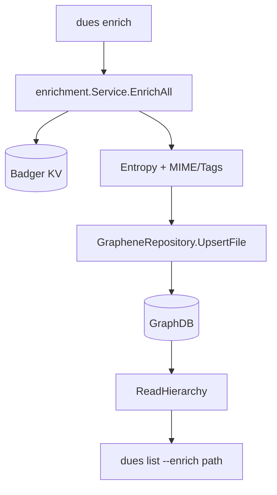
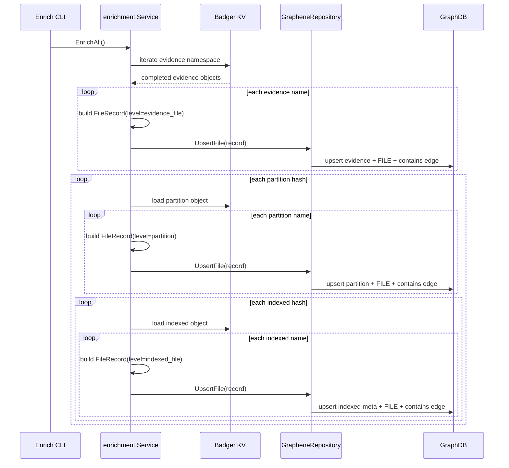

# Enrichment LLD (Low-Level Design)

## 0) One-Page Quick Reference

### 0.1 Purpose

The enrichment subsystem materializes file hierarchy metadata into GraphDB so
downstream features (list output, micro-artefact traversal, search context,
analytics) can query a normalized evidence tree quickly.

### 0.2 Core Rule Set (Current)

1. One file name/path = one FILE node.
2. Evidence level loops evidence names and writes one FILE node per name.
3. Partition level loops partition names and writes one FILE node per name.
4. Indexed level loops indexed names and writes one FILE node per name.
5. `is_deleted` and `is_fragmented` are name-level values (from `NameMeta`).
6. File-level enrichment nodes are self-contained; name-level node carries its
   own file facts.
7. Different names may share the same hash and must remain distinct nodes.

### 0.2.1 Modeling Principle

1. KVDB optimizes storage.
2. GraphDB optimizes information/knowledge.
3. Therefore KV compacted objects are expanded into explicit per-name nodes
   during enrichment.

### 0.3 Runtime Flow (Compact)

### 0.4 Main Files

- `lib/enrichment/service.go`
- `lib/enrichment/graphene_repository.go`
- `lib/enrichment/types.go`
- `lib/enrichment/repository.go`
- `lib/enrichment/tags.go`
- `cli/cmdenrich.go`

---

## 1) Scope

Covered in this LLD:

1. Enrichment service orchestration and traversal over KV objects.
2. Graph persistence model and upsert semantics.
3. File-level node creation rules (including name-level delete/fragment flags).
4. Entropy scoring integration and propagation.
5. Read projection (`ReadHierarchy`) consumed by enriched list output.

Not covered:

1. Parser internals creating KV evidence/partition/indexed records.
2. Micro-artefact detection logic details.
3. Search ranking internals.

---

## 2) High-Level Architecture

### 2.1 Components

1. `Service` (`lib/enrichment/service.go`)
   - Orchestrates enrichment from KVDB to GraphDB.
   - Computes entropy per logical object.
   - Classifies files (mime + tags).

2. `Repository` interface (`lib/enrichment/repository.go`)
   - Abstraction for graph persistence and reads.
   - Methods: `UpsertEvidence`, `UpsertFile`, `ReadHierarchy`, `Close`.

3. `GrapheneRepository` (`lib/enrichment/graphene_repository.go`)
   - Concrete GraphDB adapter using Graphene store.
   - Upserts structure nodes and FILE nodes.
   - Reconstructs hierarchy for callers.

4. KV source objects (`lib/structs/filestruct.go`)
   - `EvidenceFile`, `PartitionFile`, `IndexedFile`.
   - Names map + per-name metadata (`NameMeta`).

### 2.2 Node Types in GraphDB

Custom Graph node labels:

1. `nodeTypeEvidenceFile`
2. `nodeTypePartition`
3. `nodeTypeIndexedFile`
4. `nodeTypeFile`

Edges:

1. `contains` from evidence -> partition
2. `contains` from partition -> indexed metadata node
3. `contains` from parent level -> FILE node

Parent for FILE node depends on level:

1. evidence-level FILE: parent is evidence node
2. partition-level FILE: parent is partition node
3. indexed-level FILE: parent is indexed metadata node

---

## 3) Data Contracts

### 3.1 `FileRecord`

`FileRecord` is the write payload from service to repository.

Key fields:

1. `Level`: `evidence_file | partition | indexed_file`
2. File identity:
   - `FileName`
   - `Path`
3. Shared metadata:
   - `Size`, `FileType`, `MimeType`, `Tags`, `Entropy`, `HasEntropy`
4. Name-level status:
   - `IsDeleted`, `IsFragmented`
5. Hierarchy references:
   - `EvidenceFileID`, `PartitionID`, `IndexedFileID`, etc.

### 3.2 FILE Node ID Strategy

`buildFileNodeID()` in `lib/enrichment/types.go`:

1. Uses `Path` as primary identity token.
2. Falls back to `FileName` if `Path` is empty.
3. Namespace is level-specific:
   - evidence: hash(`evidence_file_id`, identity)
   - partition: hash(`partition_id`, identity)
   - indexed: hash(`indexed_file_id`, identity)

Result: stable, deterministic, idempotent file-node identity.

---

## 4) Write Path Design

## 4.1 Entry Points

1. CLI command `enrich` triggers `Service.EnrichAll()`.
2. Store-time incremental enrichment can call `Service.EnrichPartition(...)`.

### 4.2 `EnrichAll()` Sequence

1. Count work (`countIndexedObjectsForEnrichment`) for progress bar.
2. Iterate evidence KV namespace (`E|||:`).
3. For each completed evidence object:
   - Normalize name metadata (`ensureIndexedNameMeta`).
   - Compute evidence entropy (cached by namespace+hash key).
   - Loop evidence names and write one evidence-level FILE node per name.
4. For each linked partition hash:
   - Load partition KV object.
   - Compute partition entropy.
   - Loop partition names and write one partition-level FILE node per name.
   - Loop indexed hashes and delegate to `enrichIndexedHash`.

### 4.3 `enrichIndexedHash()` Sequence

1. Resolve indexed hash bytes and canonical base64 key.
2. Load indexed object from KV (`dbio.GetIndexedFile`).
3. Normalize per-name metadata (`ensureIndexedNameMeta`).
4. Compute indexed entropy.
5. Loop indexed names and write one indexed-level FILE node per name.

### 4.4 Name-Level Status Rule

At each level, each looped name reads status from `NameMeta[name]`:

1. `IsDeleted`
2. `IsFragmented`

Shared fields copied to each per-name record:

1. `Size`
2. `FileType` (where available)
3. `Entropy` / `HasEntropy`
4. hierarchy IDs

Special case on indexed level:

1. `IsDeleted` is merged as `indexedFile.IsDeleted || meta.IsDeleted`.

### 4.5 MIME and Tag Enrichment

`classifyFile(path, indexedType)` in `lib/enrichment/tags.go`:

1. MIME inference by extension, then indexed type fallback.
2. Heuristic tags, sorted deterministically:
   - `image`
   - `document`
   - `credential`
   - `archive`
   - `script`
   - `browser artefact`

---

## 5) Graph Persistence Semantics

### 5.1 Upsert Behavior

`GrapheneRepository.upsertNode(...)`:

1. Look up by indexed property key (`NodesByProperty`).
2. Reuse existing node if found.
3. Else create node and index that property.

This supports idempotent repeated enrichment.

### 5.2 Structural Nodes

1. Evidence node keyed by `evidence_file_id`.
2. Partition node keyed by `partition_id`.
3. Indexed metadata node keyed by `indexed_file_id`.

Indexed metadata node carries shared indexed-level facts:

1. hash
2. size
3. file_type
4. entropy + has_entropy
5. parent references (`partition_id`, `evidence_file_id`)

Name-level delete/fragment flags are not stored on indexed metadata node.

### 5.3 FILE Nodes

FILE nodes store per-name file facts:

1. `name`
2. `path`
3. `hash`
4. `size`
5. `is_deleted`
6. `is_fragmented`
7. `level`
8. `file_type`
9. `mime_type`
10. `tags`
11. `entropy`, `has_entropy`
12. hierarchy references (`evidence_file_id`, `partition_id`, `indexed_file_id`)

This is intentional denormalization so each file node is independently useful
for knowledge queries without requiring parent-node joins.

Property indexes maintained for queryability:

1. `name`
2. `level`
3. `is_deleted`
4. `is_fragmented`
5. `mime_type`
6. `tags` (joined string)

---

## 6) Read Path Design (`ReadHierarchy`)

### 6.1 Output Type

`ReadHierarchy()` returns `EnrichmentHierarchy`, rooted at evidence nodes.

Structure:

1. Evidence files
2. Partitions under evidence
3. `partition.Files` as terminal file entries (flattened from indexed anchors)

### 6.2 Reconstruction Logic

For each evidence node:

1. Traverse partition neighbors.
2. For each partition, traverse indexed metadata neighbors.
3. For each indexed metadata node, traverse contained FILE neighbors.
4. Keep only FILE neighbors with `level == indexed_file`.
5. Merge indexed shared fields onto each file entry as fallback if missing:
   - `file_type`
   - `size`
   - `entropy`/`has_entropy`

Legacy fallback:

1. If indexed metadata exists but no indexed FILE nodes are found, append one
   metadata-based entry.
2. This prevents empty output for partial/older graph states.

Sorting:

1. File entries by `fileName`, tie-break `hash`.
2. Partitions by `name`.
3. Evidence files by `name`.

---

## 7) Entropy Design

### 7.1 Algorithm

`computeLogicalFileEntropy(fid, db)`:

1. Stream logical bytes (`dbio.StreamLogicalFileBytes`).
2. Build frequency count for 256 byte values.
3. Compute Shannon entropy:

$$
H = -\sum_{b=0}^{255} p_b \log_2(p_b)
$$

where $p_b = \frac{count_b}{total}$ for non-zero counts.

### 7.2 Caching

Per-run cache key:

1. `namespace + encodedHash`

This avoids repeated stream reads for same logical object within a run.

### 7.3 Failure Handling

If entropy cannot be computed:

1. `HasEntropy = false`
2. `Entropy = 0`

---

## 8) Invariants and Guarantees

1. Enrichment does not process incomplete evidence (`Completed == false`).
2. One name/path maps to one FILE node identity within a level scope.
3. Name-level status (`is_deleted`, `is_fragmented`) always belongs to FILE
   node.
4. Structural nodes and FILE nodes are connected by `contains` edges.
5. Re-running enrichment is idempotent at node identity/index-key level.

---

## 9) Error Handling Strategy

Errors are propagated immediately from:

1. KV decoding / unmarshalling
2. hash decode failures
3. graph upsert/index failures
4. entropy streaming failures (handled as no-entropy only in entropy helper
   path)

No best-effort partial commit behavior is implemented in service-level loop.

---

## 10) Performance Characteristics

### 10.1 Complexity (Qualitative)

1. KV traversal: linear in count of completed evidence + linked partitions +
   indexed objects.
2. Graph upserts: linear in number of per-name FILE records + structural nodes.
3. Entropy: linear in streamed byte size of each logical object, amortized via
   cache.

### 10.2 Runtime Notes

1. `EnrichAll` runs inside Badger view transaction for reads.
2. Graph writes happen per upsert call.
3. Progress bar work unit is indexed object count.

---

## 11) Test Coverage Snapshot

`lib/enrichment/service_test.go` validates:

1. FILE nodes created for evidence/partition/indexed levels.
2. Per-level node counts expected from seeded names.
3. Graph property query by `level` returns expected counts.

Current expectation for indexed level confirms flattening to per-name entries
rather than nested list inside one indexed object.

---

## 12) Integration Points

1. `cli/cmdenrich.go`
   - Creates service and runs `EnrichAll`.

2. `lib/store/list.go`
   - Uses `ReadHierarchy` for enriched listing path.
   - Emits terminal file entries in `indexedFiles`.

3. `lib/microartefact/...`
   - Reuses enrichment projections for graph-linked data views.

---

## 13) Known Tradeoffs and Future Work

1. Graph write batching is not currently applied; high-volume enrichment may
   benefit from batched edge/node operations if Graphene API supports it.
2. Legacy fallback in `ReadHierarchy` is pragmatic but can mask partially
   enriched states; optional strict mode could disable fallback.
3. Additional indexes on `path` and `file_node_id` query patterns may improve
   high-cardinality lookups.

---

## 14) Sequence Diagram (Detailed)

---

## 15) Practical Debug Checklist

1. Missing enriched output:
   - confirm evidence objects are `Completed=true` in KV.
2. Wrong delete/fragment flags:
   - inspect `NameMeta` on source object for that exact name/path.
3. Entropy always zero:
   - verify logical bytes are accessible via `StreamLogicalFileBytes`.
4. Duplicate-looking records:
   - verify path canonicalization consistency before hashing to `file_node_id`.
5. Outdated CLI output:
   - run with current source binary (`go run . ...`) after changes.
