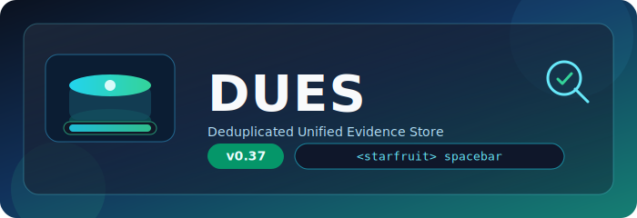

# DUES - Deduplicated Unified Evidence Store

<p align="center">
  
</p>

[](https://golang.org)
[](https://github.com/aoiflux/indicer)
[](LICENSE)

DUES is a powerful digital forensics tool designed for storing, analyzing, and searching disk images and files with advanced deduplication, encryption, and relationship analysis capabilities. It's specifically built for forensic examiners who need to efficiently manage and analyze large volumes of digital evidence.

**Patent Information**: This software has led to two derivative inventions protected by patents **567877** and **556272** registered at the Indian Patent Office.

## Features

### Core Capabilities

- **Chunk-based Deduplication**: Efficiently stores files by breaking them into chunks (default 256KB) and deduplicating at the chunk level
- **Encrypted Storage**: Optional AES encryption with password protection for secure evidence storage
- **Compression**: Zstandard compression with configurable levels for optimal storage efficiency
- **Partition Detection**: Automatically detects and parses disk image partitions (MBR, exFAT)
- **File System Indexing**: Indexes files within disk images for granular analysis
- **Near Duplicate Detection (NeAr)**: Identifies files with similar content using advanced chunk matching algorithms
- **Full-Text Search**: Fast content search across all stored artifacts with detailed reporting
- **Graph Visualization**: Generates interactive HTML graphs (GReAt) showing file relationships

### Performance Modes

- **High Performance Mode** (default): Utilizes maximum system resources for speed
- **Low Resource Mode** (`-l`): Optimized for systems with limited memory/CPU
- **Quick Mode** (`-q`): Bypasses encryption and compression for maximum throughput

## Installation

### Prerequisites

- Go 1.25 or higher
- Windows, Linux, or macOS

### Build from Source

```bash
git clone https://github.com/aoiflux/indicer.git
cd indicer
go build -o dues.exe
```

## Usage

### Basic Commands

#### Store Evidence Files

Store a single file or entire directory:

```powershell
# Store a disk image
dues store evidence.dd

# Store with custom database path
dues store -d C:\forensics\case1 evidence.dd

# Store with encryption
dues store -p mypassword evidence.dd

# Store entire folder
dues store -d C:\forensics\db evidence_folder\

# Store without indexing
dues store -n evidence.dd

# Synchronous indexing (blocking)
dues store -s evidence.dd
```

#### List Stored Files

View all files in the database:

```powershell
dues list

# With password-protected database
dues list -p mypassword -d C:\forensics\case1
```

#### Restore Files

Extract files from the database:

```powershell
# Restore by hash
dues restore <file_hash>

# Restore to specific location
dues restore -f C:\output\restored_file <file_hash>

# With password
dues restore -p mypassword <file_hash>
```

#### Search Content

Search for text across all stored artifacts:

```powershell
# Basic search
dues search "search term"

# Search in password-protected database
dues search -p mypassword "confidential"

# Custom database path
dues search -d C:\forensics\case1 "evidence"
```

Search generates a detailed JSON report (`report.json`) with:
- Total occurrences found
- Files containing the search term
- Hierarchical file relationships (disk image → partition → indexed files)
- Executive summary for reporting

#### Near Duplicate Analysis (NeAr)

Find files with similar content:

```powershell
# Analyze file inside database
dues near in <file_hash>

# Deep analysis (partial chunk matching)
dues near in -e <file_hash>
```

Generates an interactive HTML graph (`graph.html`) visualizing file relationships.

#### Database Management

```powershell
# Reset/delete database
dues reset

# Custom database path
dues reset -d C:\forensics\case1
```

### Command-Line Options

#### Global Flags

| Flag | Short | Description | Default |
|------|-------|-------------|---------|
| `--dbpath` | `-d` | Custom path for DUES database | `./dues_db` |
| `--password` | `-p` | Password for database encryption | None |
| `--chonksize` | `-c` | Chunk size in KB for deduplication | `256` |
| `--low` | `-l` | Low resource mode | `false` |
| `--quick` | `-q` | Quick mode (no encryption/compression) | `false` |

#### Store Command Flags

| Flag | Short | Description | Default |
|------|-------|-------------|---------|
| `--sync` | `-s` | Run indexer synchronously | `false` |
| `--no-index` | `-n` | Skip file indexing | `false` |

#### Restore Command Flags

| Flag | Short | Description | Default |
|------|-------|-------------|---------|
| `--filepath` | `-f` | Output path for restored file | `restored` |

#### Near Command Flags

| Flag | Short | Description | Default |
|------|-------|-------------|---------|
| `--deep` | `-e` | Enable partial chunk matching | `false` |

## Architecture

### Storage Model

DUES uses a hierarchical storage model:

```
Evidence File (Disk Image)
  └── Partitions (p0, p1, p2, ...)
      └── Indexed Files (files within partition)
```

### Namespaces

Data is organized into separate namespaces:

- `E|||:` - Evidence files (disk images)
- `P|||:` - Partition files
- `I|||:` - Indexed files (files within partitions)
- `C|||:` - Chunks (deduplicated data blocks)
- `R|||:` - Relations (chunk → file mapping)
- `Я|||:` - Reverse relations (file → chunk mapping)

### Database Technology

- **BadgerDB**: High-performance key-value store
- **Memory-mapped I/O**: Efficient file reading
- **Zstandard Compression**: Fast compression/decompression
- **SHA3-256**: Cryptographic hashing for integrity

## Use Cases

### Digital Forensics

- Store large disk images efficiently with deduplication
- Search across multiple evidence files simultaneously
- Track file provenance through partition hierarchy
- Identify near-duplicate files for timeline analysis

### Incident Response

- Quick triage with search functionality
- Identify related files using NeAr analysis
- Secure evidence storage with encryption
- Low-resource mode for field deployment

### E-Discovery

- Full-text search across document collections
- Generate detailed search reports with file locations
- Track document relationships through graph visualization

## Performance Considerations

### Chunk Size

- Smaller chunks (64KB-128KB): Better deduplication, slower processing
- Larger chunks (256KB-512KB): Faster processing, less deduplication
- Default 256KB balances both concerns

### Resource Modes

**High Performance** (default):
- Uses all available CPU cores
- Allocates up to 25% of available RAM for caching
- Parallel processing of chunks

**Low Resource** (`-l`):
- Single-threaded processing
- 64KB cache limit
- Reduced batch sizes
- Lower energy consumption

**Quick Mode** (`-q`):
- Skips encryption
- Minimal compression
- No inter-chunk compression
- Maximum throughput for time-critical operations

## Output Files

- `report.json` - Search results with detailed occurrence data
- `graph.html` - Interactive relationship graph (requires vis.min.js)
- `BLOBS/*.blob` - Deduplicated chunk data storage

## Dependencies

Key libraries used:

- `github.com/dgraph-io/badger/v4` - Embedded database
- `github.com/klauspost/compress` - Zstandard compression
- `github.com/alecthomas/kingpin/v2` - CLI framework
- `golang.org/x/crypto` - Cryptographic operations
- `github.com/aoiflux/libxfat` - exFAT parsing
- `github.com/diskfs/go-diskfs` - Disk/partition parsing

## Best Practices

1. **Use encryption** for sensitive evidence: Always use `-p` flag with a strong password
2. **Choose appropriate chunk size**: Smaller for better deduplication, larger for speed
3. **Index selectively**: Use `-n` flag to skip indexing for non-disk-image files
4. **Regular database backups**: DUES database contains all evidence metadata
5. **Deep analysis sparingly**: Use `-e` flag only when needed (computationally expensive)

## Troubleshooting

### Common Issues

**Out of memory errors**:
- Use `-l` flag for low resource mode
- Increase chunk size with `-c 512` or higher

**Slow performance**:
- Disable indexing with `-n` if not needed
- Use quick mode `-q` for non-encrypted storage
- Increase chunk size for large files

**Database corruption**:
- Ensure database is properly closed after operations
- Use password consistently across operations
- Avoid concurrent access from multiple processes

## Version History

**v3.5** (Current)
- Enhanced NeAr analysis with partial chunk matching
- Improved search reporting with executive summaries
- Performance optimizations for low-resource environments
- Container mode to pack chunks into 1GB BLOBs
- Hierarchical block index that stores chunk metadata in block files

## License

This project is licensed under the MIT License - see the LICENSE file for details.

## Contributing

Contributions are welcome! Please feel free to submit pull requests or open issues for bugs and feature requests.
