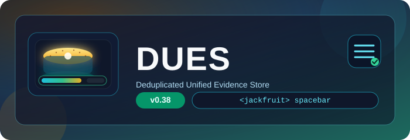

# DUES - Deduplicated Unified Evidence Store

<p align="center">
  
</p>

[](https://golang.org)
[](https://github.com/aoiflux/indicer)
[](LICENSE)

DUES is a digital forensics data platform for ingesting, deduplicating,
indexing, searching, restoring, and comparing large evidence sets.

Version: 0.38 Codename: <jackfruit> spacebar

## Important upgrade notice (breaking)

v0.38 introduces structural changes in on-disk DB and index layouts.

- Older DB directories may not be fully compatible with this release.
- Reusing older DB paths without migration or rebuild can cause read/startup
  failures.
- Back up existing DB paths before upgrading.
- After upgrade, run repair and reindex/restore workflows to rebuild state in
  the new format.

## Release summary

This release is a large cross-cutting update focused on reliability, retrieval
quality, and investigation speed.

- Storage pipeline improvements with better reliability and throughput tuning.
- Restore pipeline upgrades, including multithreaded restore controls.
- Search relevance improvements with BM25 and hybrid full-text fallback.
- New enrichment pipeline for evidence, partition, and indexed-file metadata.
- New micro-artefact extraction and graph workflows.
- Near-similarity and SimHash enhancements for in-db and out-of-db matching.
- Expanded server capabilities for browser upload sessions.
- Wider test and benchmark coverage across core subsystems.

Patent information: this software has led to two derivative inventions protected
by patents 567877 and 556272 registered at the Indian Patent Office.

## Feature highlights

### 1) Ingest, dedup, and storage

- Chunk-level deduplication with configurable hash algorithm.
- Default hashing is BLAKE3; SHA3 is also supported.
- Optional password-based encrypted DB operation.
- Per-chunk zstd compression with tunable compression level.
- Container mode for large-scale blob packing.
- Hierarchical block index mode for scalable lookup paths.
- Ingest validation and startup recovery for incomplete ingests.
- Repair tooling to inspect and optionally mark partial ingests as failed.

### 2) Image parsing with libtsk (via libtusk)

- DUES now uses libtusk (a C wrapper over The Sleuth Kit) for partition table
  and filesystem parsing on supported targets.
- This enables richer partition/filesystem-aware indexing behavior aligned with
  forensic image analysis use cases.
- Current CGO/libtusk-enabled targets: windows/amd64 and linux/amd64.
- On unsupported targets, DUES falls back to internal parsing (MBR/exFAT path).
- Fragmented-file handling remains limited in current parser flow; fragmented
  entries are reported and skipped by the libtusk indexing path.

See also:

- [TOOLCHAIN_NOTES.md](TOOLCHAIN_NOTES.md)
- [clib/LIBTUSK_ABI.md](clib/LIBTUSK_ABI.md)

### 3) Search and ranking

- Query parsing with AND/OR/phrase search behaviors.
- BM25-driven ranking support.
- Occurrence-aware rank adjustment via rank-alpha.
- Hybrid mode: full-text sidecar first, automatic fallback to scan search.
- Search output generation for report workflows.

### 4) Near similarity

- Near in: compare objects already stored in DUES.
- Near out: compare external files against DUES content.
- SimHash-enabled workflows and top-K verification options.
- Optional deep and explain-exact behaviors for investigation workflows.

### 5) Enrichment and micro-artefacts

- Graph enrichment command to backfill hierarchy metadata.
- Micro-artefact extraction pipeline across indexed files.
- Detector and parser expansion for common forensic artefact patterns.
- Graph export support, including interactive HTML output.

### 6) API, server, and browser upload path

- Connect + gRPC + gRPC-Web server mode on port 50051.
- Localhost-aware CORS behavior for browser clients.
- Browser upload session endpoints:
  - POST /web/upload/start
  - POST /web/upload/chunk
  - POST /web/upload/finalize
- Health endpoint at GET /

### 7) TUI and operator workflow

- Bubble Tea v2 based TUI with integrated store/list/search/restore/near/reset
  flows.
- Improvements to command-line operational ergonomics and status visibility.

## Installation

### Prerequisites

- Go 1.25+
- Windows, Linux, or macOS

### Build

```bash
git clone https://github.com/aoiflux/indicer.git
cd indicer
go build -o dues .
```

Windows users may prefer:

```powershell
go build -o dues.exe .
```

## Quick start

```powershell
# Store evidence (file or folder)
dues store E01-image.dd --enable-enrichment --enable-fts

# List entries
dues list

# Search (scan ranking)
dues search "invoice payment"

# Hybrid full-text first, then fallback
dues search --enable-fts "invoice|receipt"

# Restore by hash
dues restore <hash> --filepath restored.bin

# Near similarity from DB object
dues near in <hash> --advanced-deep --topk 50

# Near similarity for external file
dues near out suspect.bin --explain-exact

# Backfill hierarchy enrichment in graphdb
dues enrich

# Extract micro-artefacts and export graph.html
dues micro extract --top-k 25

# Inspect/repair pending ingests
dues repair
dues repair --fix

# Launch TUI
dues tui
```

## Command summary

Core commands:

- dues store FILE
- dues list
- dues search QUERY
- dues restore HASH
- dues near in HASH
- dues near out FILE
- dues stats
- dues repair [--fix]
- dues enrich
- dues micro extract
- dues micro list
- dues server
- dues tui
- dues version
- dues reset

## Important flags

Global:

- --dbpath, -d: custom database path
- --password, -p: password for encrypted DB access
- --chonksize, -c: chunk size in KB (default 256)
- --low, -l: low-resource mode
- --quick, -q: throughput-first mode
- --container, -x: container blob mode
- --hierarchical, -i: hierarchical index mode
- --compress-level: fast, default, or best

Store-specific highlights:

- --sync, -s: synchronous indexing
- --no-index, -n: skip indexing
- --enable-fts: build sidecar full-text index
- --enable-enrichment: upsert hierarchy metadata to graphdb
- --hash-algo, -g: sha3 or blake3
- --hash-strategy: sync or async (evidence hash timing only; default sync)
- --simhash: compute chunk SimHash signatures during ingest
- --store-workers and --store-queue: override ingest pipeline tuning

Restore-specific highlights:

- --filepath, -f: output path
- --restore-workers, --restore-queue: pipeline tuning
- --restore-progress-ms: progress update interval
- --restore-buffer-mb: write buffer sizing

Search-specific highlights:

- --rank-alpha: occurrence boost weighting
- --enable-fts: hybrid full-text + fallback scan path

Near-specific highlights:

- --deep, -e: partial chunk matching
- --advanced-deep, -a: phase-2 full-file SimHash rerank
- --topk, -k: top-K candidates for phase-2 rerank
- --explain-exact, -x: force chunk drilldown for exact out-file match

## Migration checklist (pre-0.38 to 0.38)

1. Back up current DB directory.
2. Upgrade binary to v0.38.
3. Run dues repair and review pending/failed evidence.
4. Re-run store/index paths where needed for format alignment.
5. Re-run enrichment and micro extract if graph metadata is required.
6. Validate search and restore outputs on representative samples.

## Architecture and design docs

- [STORE_LLD.md](docs/STORE_LLD.md)
- [STORE_BOTTLENECKS.md](docs/STORE_BOTTLENECKS.md)
- [SEARCH_LLD.md](docs/SEARCH_LLD.md)
- [ENRICHMENT_LLD.md](docs/ENRICHMENT_LLD.md)
- [MICRO_ARTEFACT_DEEP_DIVE.md](docs/MICRO_ARTEFACT_DEEP_DIVE.md)
- [NEAR_SIMILARITY_LLD.md](docs/NEAR_SIMILARITY_LLD.md)
- [HIERARCHICAL_INDEX.md](docs/HIERARCHICAL_INDEX.md)
- [CONTAINER_MODE_LLD.md](docs/CONTAINER_MODE_LLD.md)
- [CONTAINER_MANAGER_CURRENT.md](docs/CONTAINER_MANAGER_CURRENT.md)
- [RESTORE_LLD.md](docs/RESTORE_LLD.md)
- [BENCHMARKING.md](docs/BENCHMARKING.md)
- [TUI_QUICKSTART.md](docs/TUI_QUICKSTART.md)
- [TUI_IMPLEMENTATION.md](docs/TUI_IMPLEMENTATION.md)

## Output artefacts

- report.json: search report output
- graph.html: similarity and micro-artefact graph visualisations
- BLOBS/*.blob: deduplicated chunk/container data

## License

MIT. See [LICENSE](LICENSE).

## Contributing

Issues and pull requests are welcome.
