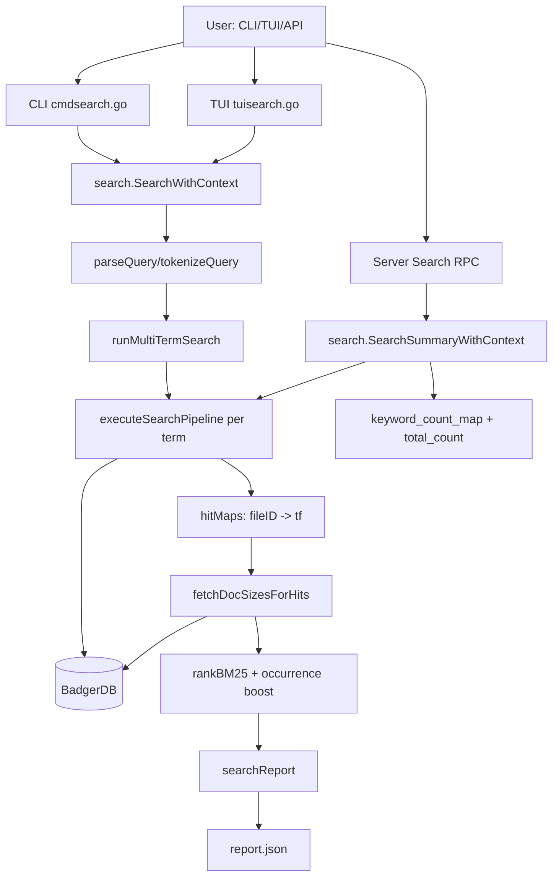
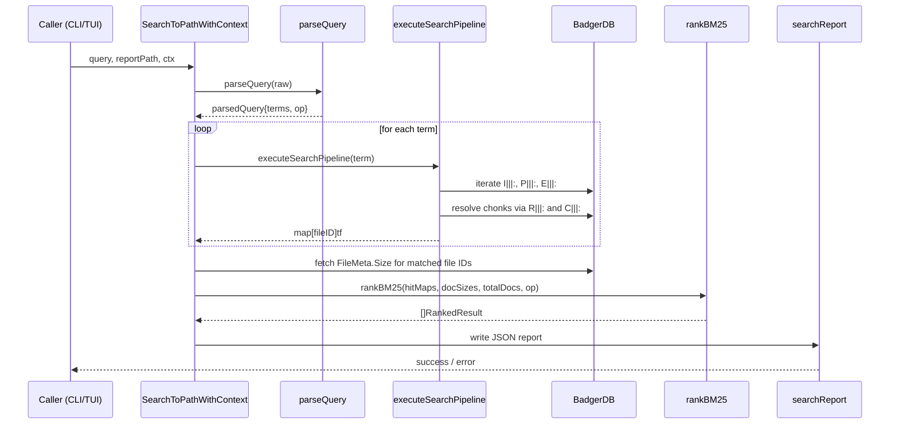

# Search LLD (Low-Level Design)

## 0) One-Page Quick Reference

### 0.1 Fast command cheat-sheet

- Single-term search:
  - `dues search -d ./data exe`
- Multi-term AND (default):
  - `dues search -d ./data "exe dll"`
- Multi-term OR:
  - `dues search -d ./data "exe|dll"`
- Phrase:
  - `dues search -d ./data "\"kernel32.dll\""`
- Stronger occurrence influence in ranking:
  - `dues search -d ./data --rank-alpha 0.8 exe`
- Pure BM25 ordering:
  - `dues search -d ./data --rank-alpha 0 exe`

### 0.2 What happens at runtime (quick view)

1. Parse query (`AND` / `OR` / phrase)
2. Run scan pipeline once per query term
3. Merge candidate set based on query operator
4. Fetch matched document sizes
5. Rank using BM25 + occurrence boost (`rank-alpha`)
6. Emit `report.json` (ordered by final rank)

### 0.3 Compact architecture diagram

```mermaid
flowchart LR
    U[User] --> CLI[CLI/TUI/API]
    CLI --> Q[Query Parser]
    Q --> SP[Scan Pipeline x term]
    SP --> DB[(BadgerDB)]
    SP --> HM[Hit Maps]
    HM --> DS[Doc Sizes]
    DS --> RK[BM25 + alpha*log1p(TF)]
    RK --> RP[Report Writer]
    RP --> OUT[report.json]
```

### 0.4 Debug quick checklist

- Wrong ordering:
  - verify `--rank-alpha` value used in command
- No/low hits:
  - verify query mode (`foo bar` vs `foo|bar` vs `"foo bar"`)
- `Key not found` in older runs:
  - rebuild binary: `go build -o ./dues.exe .`
- Canceled runs:
  - check terminal `Ctrl+C` or TUI `Esc`/`Ctrl+C`

### 0.5 Extension quick checklist

- New operator:
  - update `query.go`, candidate-set logic, parser tests
- New ranking behavior:
  - update `bm25.go`, keep deterministic tie-breaks, add tests
- New report fields:
  - update `report.go`, wire in `searchReport`, version if compatibility risk

### 0.6 Diagram export (image)

If you want PNG/SVG exports of the Mermaid diagrams:

1. Copy the Mermaid block from this file.
2. Render with any Mermaid-compatible tool (for example Mermaid Live Editor or
   mermaid-cli).
3. Commit generated assets under a docs folder (example:
   `docs/diagrams/search-architecture.svg`).

---

## 1) Purpose

This document describes the DUES search subsystem in implementation-level
detail. It covers:

- runtime architecture and execution flow
- query parsing and ranking internals
- user guide (CLI, TUI, API usage)
- debugging and troubleshooting playbooks
- extension guide for developers

Target audience:

- users running `dues search`
- contributors modifying `lib/search`
- API integrators using server Search RPC

---

## 2) Scope and Current Capabilities

Implemented today:

- case-insensitive substring scan over indexed/partition/evidence namespaces
- multi-term query parsing:
  - AND: `foo bar`
  - OR: `foo|bar`
  - phrase: `"foo bar"`
- BM25-based scoring with occurrence-aware ordering
- configurable occurrence influence: `--rank-alpha`
- optional full-text sidecar mode with automatic scan fallback: `--fulltext`
- JSON report generation (`report.json`)
- context cancellation support in CLI and TUI

Not implemented in current search path:

- regex query
- fuzzy query
- inverted index (current design is scan-based)

Current full-text implementation note:

- sidecar index is used to narrow candidates and add a light ranking boost in
  `--fulltext` mode; scan search remains the source of truth for final counts
  and report payloads.

---

## 3) Module Map

Primary code locations:

- `lib/search/search.go`: orchestration, scanning, report generation
- `lib/search/query.go`: query parser/tokenizer
- `lib/search/bm25.go`: ranking logic
- `lib/structs/report.go`: report schema
- `cli/cmdsearch.go`: CLI entrypoint wiring for search and `--rank-alpha`
- `main.go`: CLI flags and command dispatch
- `lib/server/search.go`: Search RPC (count summary path)
- `tui/tuisearch.go`: TUI search flow with cancel behavior

---

## 4) End-to-End Architecture



Key split:

- `SearchToPathWithContext`: full report path, ranking enabled
- `SearchSummaryWithContext`: server summary path, returns raw counts (no BM25
  payload)

---

## 5) Execution Flow (Detailed)



Cancellation semantics:

- context is checked before and during loops
- first terminal worker error triggers shared cancel (fail-fast)
- TUI `esc`/`ctrl+c` cancels active search

---

## 6) Query Language LLD

Parser file: `lib/search/query.go`

Rules:

- OR mode if raw query contains `|`
- otherwise AND mode
- quoted spans are single phrase terms
- all terms are normalized to lowercase
- each term must be length >= 2

Practical examples:

- `dues search "invoice payment"`
  - AND: documents must match both `invoice` and `payment`
- `dues search "invoice|receipt"`
  - OR: documents matching either term are candidates
- `dues search "\"error code\""`
  - phrase term `error code`

Matching implementation is byte-oriented substring counting.

---

## 7) Scan and Match Internals

### 7.1 Namespace scan

Search scans these namespaces:

- `I|||:` indexed files
- `P|||:` partition files
- `E|||:` evidence files

### 7.2 Chonk fetch path

For each logical file and chonk offset:

1. read relation key: `R|||:<eviHash>|||<offset>` -> chonk hash
2. read chonk payload via `C|||:<chonkHash>`
3. count term occurrences in chonk bytes
4. apply cross-boundary overlap check with next chonk

### 7.3 Case folding

- ASCII query path: custom non-allocating fold/match loop
- non-ASCII query path: fallback `bytes.ToLower(chonk)` + `bytes.Count`

### 7.4 Error hardening

- missing metadata/chonk keys (`badger.ErrKeyNotFound`) are skipped in scan
  paths
- malformed search IDs are rejected in report generation

---

## 8) Ranking LLD

File: `lib/search/bm25.go`

### 8.1 BM25 base score

For each term/document pair:

- IDF:

$$
IDF = \log\left(1 + \frac{N - DF + 0.5}{DF + 0.5}\right)
$$

- TF normalization:

$$
TF_{norm} = \frac{TF \cdot (k_1 + 1)}{TF + k_1 \cdot (1 - b + b \cdot L/L_{avg})}
$$

- Per-term contribution:

$$
score += IDF \cdot TF_{norm}
$$

where:

- $k_1 = 1.5$
- $b = 0.75$
- $L$ = document size (`FileMeta.Size`)
- $L_{avg}$ = average candidate document length

### 8.2 Candidate selection by query op

- AND: intersection across term hit maps
- OR: union across term hit maps

### 8.3 Occurrence-aware ordering

Sort key uses hybrid rank:

$$
rankScore = BM25 + \alpha \cdot \log(1 + TF_{sum})
$$

- `alpha` = occurrence boost (`--rank-alpha`, default `0.35`, clamped to `>= 0`)
- stable tie-breaks:
  1. higher `rankScore`
  2. higher raw BM25
  3. higher `TF`
  4. lexicographically smaller `fileID`

Note:

- report field `bm25_score` stores pure BM25 score (not hybrid rank)

---

## 9) Report Generation LLD

Schema type: `lib/structs/report.go`

Current report fields:

- `schema_version` (currently `v1`)
- `query`
- `executive_summary`
- `occurances` (legacy JSON spelling retained for compatibility)
- each occurrence includes:
  - `artefact`
  - `count`
  - `bm25_score`
  - `files` and/or `disk` hierarchy

`matches` was removed from search report schema because it was unused.

---

## 10) User Guide (How To Use Effectively)

### 10.1 Basic usage

- Single term:
  - `dues search -d ./data invoice`
- AND query:
  - `dues search -d ./data "invoice payment"`
- OR query:
  - `dues search -d ./data "invoice|receipt"`
- Phrase query:
  - `dues search -d ./data "\"error code\""`
- Full-text with fallback:
  - `dues search -d ./data --fulltext "exe|dll"`

### 10.2 Ranking tuning

- Default blend:
  - `dues search -d ./data invoice`
- Stronger occurrence influence:
  - `dues search -d ./data --rank-alpha 0.8 invoice`
- Pure BM25 ordering:
  - `dues search -d ./data --rank-alpha 0 invoice`

### 10.3 Full-text mode

- `--fulltext` tries sidecar full-text search first.
- If sidecar index is missing, DUES auto-builds it from indexed-file metadata.
- If sidecar results are empty/unhelpful, DUES falls back to regular scan path.
- Final report still uses scan-derived counts and schema.

Tuning guidance:

- start with `0.35` (default)
- use `0.6-1.0` when you want frequent hits to dominate
- use `0` for strict BM25 ranking experiments

### 10.4 Canceling search

- CLI: `Ctrl+C`
- TUI: `Esc` or `Ctrl+C` while search is running

### 10.5 Reading results

- output file is `report.json` by default
- ranking appears as occurrence order in `occurances`
- per-result fields:
  - `count`: summed raw term hits (TF)
  - `bm25_score`: relevance score for that artefact

---

## 11) Developer Guide

### 11.1 Core extension points

- parser behavior: `lib/search/query.go`
- ranking behavior: `lib/search/bm25.go`
- scan orchestration: `lib/search/search.go`
- report schema/serialization: `lib/structs/report.go`

### 11.2 Adding a new query operator

Recommended path:

1. extend `queryOp` and `parseQuery`
2. update candidate set logic in `buildCandidateSet`
3. add parser/ranking tests in `lib/search/query_bm25_test.go`
4. update README + this doc

### 11.3 Adding a new ranking strategy

Recommended path:

1. keep `rankBM25` pure and deterministic
2. add a new ranking function or configurable scorer
3. avoid mutating global state from goroutines
4. include deterministic tie-break order
5. preserve report compatibility (`bm25_score` semantics) or version schema

### 11.4 Adding snippet extraction (future)

Potential design:

1. in `searchChonk`, collect top-K byte windows around matches
2. attach snippets in a new schema field (versioned)
3. gate with optional flag to avoid memory overhead on large scans

### 11.5 Server API evolution

Current RPC `SearchRes` only returns counts. To expose ranked results:

1. add new proto message with ranked rows (`file_id`, `count`, `bm25_score`)
2. implement in `lib/server/search.go`
3. keep existing RPC for backward compatibility

---

## 12) Debugging and Troubleshooting Guide

### 12.1 Fast checks

- validate build:
  - `go build -o ./dues.exe .`
- run focused tests:
  - `go test ./lib/search ./lib/server ./lib/structs`

### 12.2 Common symptoms

| Symptom                         | Likely Cause                        | What To Check                                     |
| ------------------------------- | ----------------------------------- | ------------------------------------------------- |
| `search query too small`        | term length < 2                     | parser validation in `validateParsedQuery`        |
| report has unexpected ordering  | `--rank-alpha` differs              | CLI invocation and `SetOccurrenceBoostAlpha` path |
| `Key not found` in old binaries | stale executable                    | rebuild `dues.exe` explicitly                     |
| no hits for expected phrase     | query parsing mode mismatch         | confirm quotes and OR separators                  |
| search canceled early           | context canceled / user interrupted | CLI signal handling or TUI cancel path            |

### 12.3 Runtime tracing tips

- verify CLI flag parse path in `main.go` search command block
- inspect `SearchToPathWithContext` for progress and error boundaries
- inspect `searchFiles` and `searchChonks` for fail-fast cancellation
- inspect `searchReport` when JSON output shape is wrong

### 12.4 Determinism checks

If ordering appears unstable:

1. verify same dataset and same `--rank-alpha`
2. verify tie-break path in `sortRankedResults`
3. confirm no local uncommitted ranking edits

---

## 13) Testing Strategy

Current relevant tests:

- `lib/search/search_context_test.go`
  - cancellation behavior
  - short query validation
  - report path and schema version emission
  - ASCII match counting behavior
- `lib/search/query_bm25_test.go`
  - parser semantics (AND/OR/phrase)
  - candidate set logic
  - BM25 ordering and TF aggregation
  - occurrence-boost behavior and alpha clamping
- `lib/server/search_test.go`
  - server cancellation and success contract

Recommended additional tests:

- end-to-end golden reports for AND/OR/phrase combinations
- alpha sweep ranking regression (`0`, default, high values)
- large corpus performance benchmarks (scan throughput)

---

## 14) Performance Notes

Current approach is scan-based, so query latency scales with corpus size.
Throughput optimizations already in place:

- bounded worker pools (`cnst.GetMaxThreadCount`)
- streaming iterator dispatch (no full key preload)
- per-search chonk cache (`SeenChonkMap.GetOrCompute`)
- fail-fast cancellation
- ASCII hot-path matcher

Highest-impact future optimization:

- add inverted index to avoid full scans for most queries

---

## 15) Operational Checklist

Before shipping search changes:

1. `go test ./...`
2. `go build -o ./dues.exe .`
3. run smoke commands:
   - `dues search -d ./data invoice`
   - `dues search -d ./data "invoice payment"`
   - `dues search -d ./data "invoice|receipt"`
   - `dues search -d ./data --rank-alpha 0 invoice`
4. inspect `report.json` for schema and ranking sanity
5. update docs if behavior/flags/schema changed

---

## 16) Appendix: Current Public CLI Search Contract

- Command:
  - `dues search QUERY [--rank-alpha <float>] [global flags]`
- Guarantees:
  - query terms are case-insensitive
  - minimum term length is 2
  - report writes with schema version and deterministic ordering
  - cancellation is honored via context
