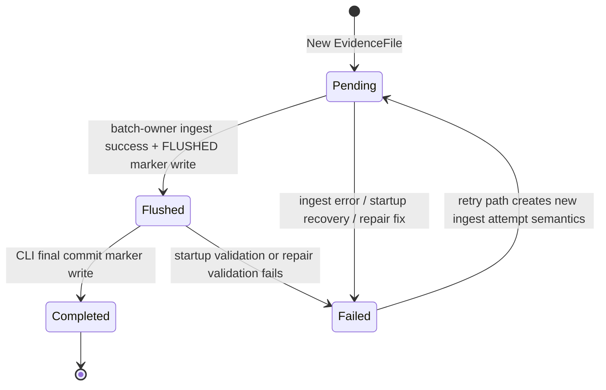
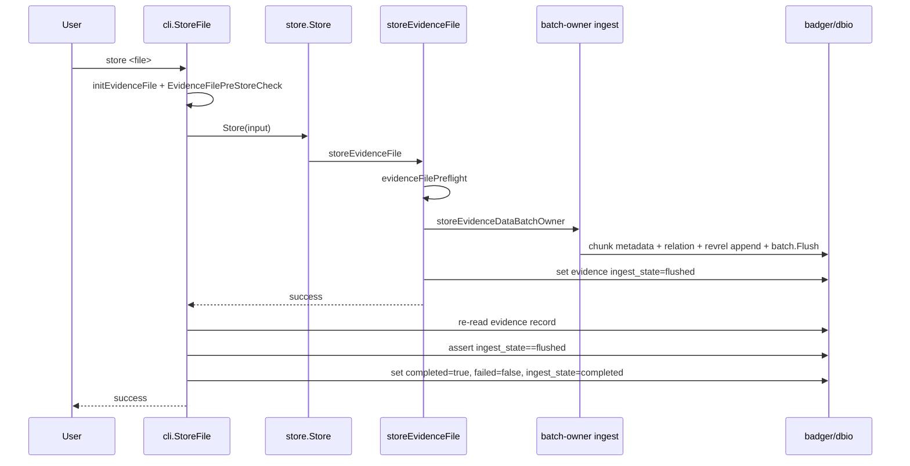
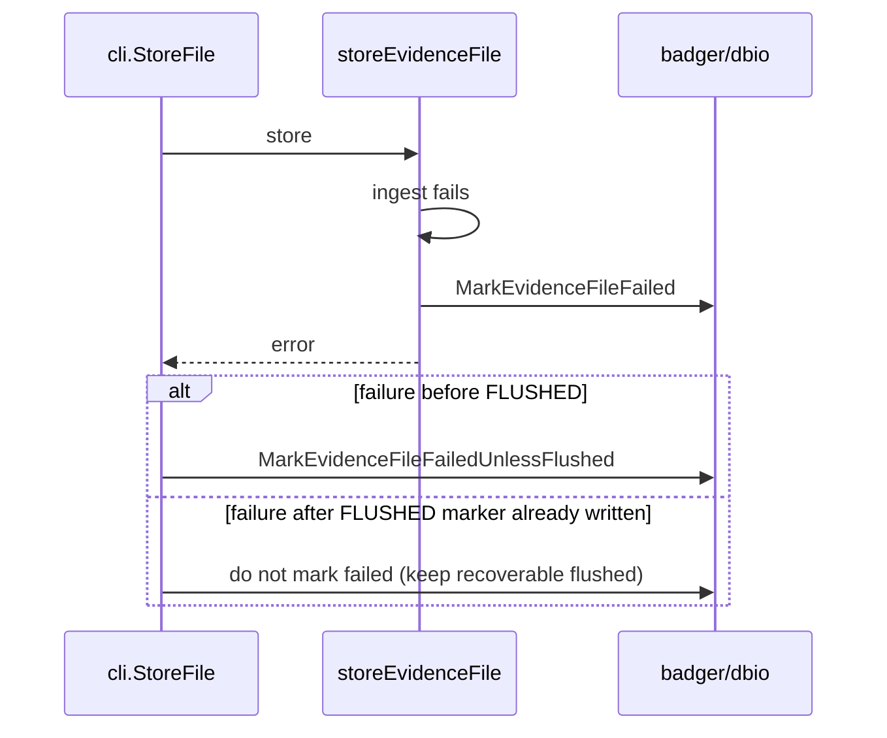
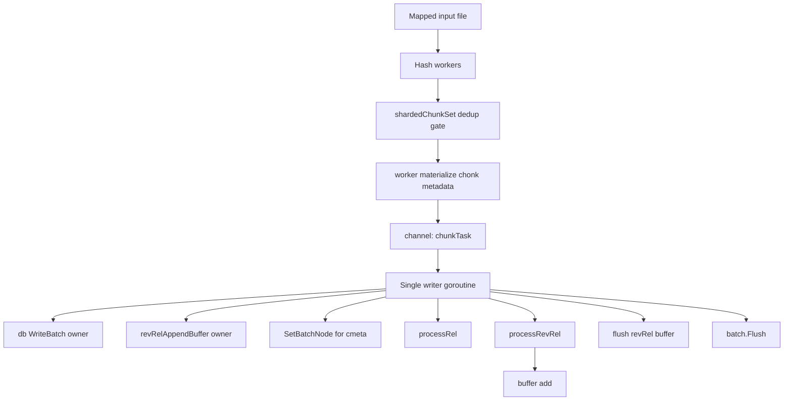
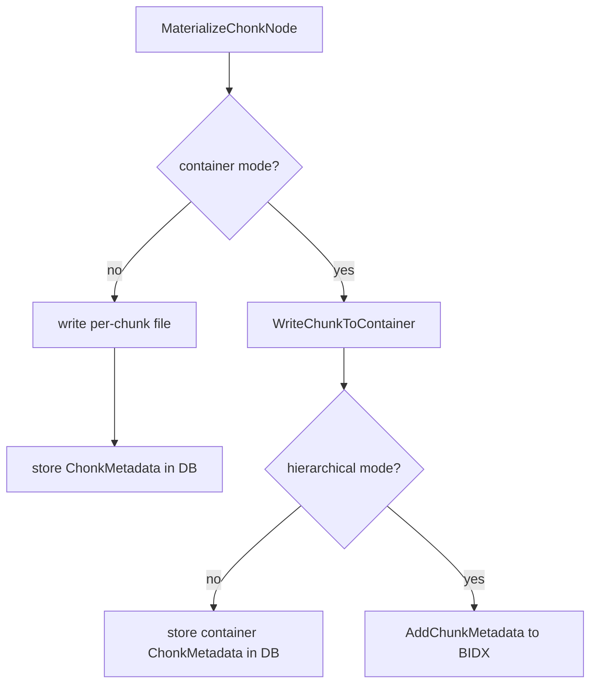
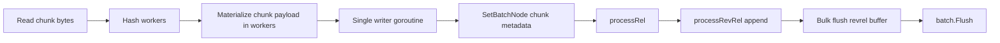

# STORE LLD

## 1. Purpose and Scope

This document is the low-level design for the current store path in
DUES/Indicer, including all major store-related features added through the Phase
1/2/4 work completed in May 2026.

The goal is twofold:

1. One-glance understanding of how ingest, commit, recovery, and restore work.
2. Deep implementation detail for maintainers extending or debugging the store
   path.

In scope:

- CLI store orchestration and final commit marker write.
- Store package ingest path (batch-owner model).
- Ingest transaction state machine and failure semantics.
- Startup recovery and repair flows.
- Reverse-relation append-primary model.
- Container and hierarchical block index integration.
- Restore read path behavior relevant to store outputs.

Out of scope:

- Full-text indexing internals.
- Enrichment graph internals.
- NeAR ranking/scoring internals (except reverse-relation data contracts
  consumed by NeAR).

---

## 2. One-Glance Architecture

### 2.1 Primary Data Flow

```mermaid
flowchart LR
    A[CLI StoreFile] --> B[initEvidenceFile + pre-store checks]
    B --> C[store.Store]
    C --> D[storeEvidenceFile]
    D --> E[evidenceFilePreflight]
    E --> F[storeEvidenceDataBatchOwner]

    F --> G[Workers hash + materialize chunks]
    G --> H[Single writer goroutine]
    H --> I[SetBatchNode(cmeta) + processRel + processRevRel]
    I --> J[batch.Flush]
    J --> K[mark evidence FLUSHED]

    K --> L[Return to CLI]
    L --> M[CLI verifies FLUSHED]
    M --> N[CLI writes COMPLETED]

    O[Startup Common] --> P[RecoverIncompleteIngests]
    P --> Q[Auto-complete valid FLUSHED or mark failed]

    R[Repair command] --> S[InspectEvidenceRepairs]
    S --> T[Optional fix: auto-complete FLUSHED / mark pending failed]
```

### 2.2 Store-Related Feature Summary

| Feature                                                              | Current status       | Core implementation                                                           |
| -------------------------------------------------------------------- | -------------------- | ----------------------------------------------------------------------------- |
| Atomic-like ingest marker sequence (PENDING -> FLUSHED -> COMPLETED) | Active               | `lib/store/store.go`, `cli/cmdstore.go`, `lib/structs/filestruct.go`          |
| Batch-owner ingest concurrency model                                 | Active and only path | `lib/store/batch_owner.go`                                                    |
| Shared-batch ingest path                                             | Removed              | Retired from runtime                                                          |
| Reverse-relation append-primary writes                               | Active               | `lib/store/store.go`, `lib/dbio/dbio.go`, `lib/store/revrel_append_buffer.go` |
| Legacy reverse-relation map read/repair compatibility                | Removed              | Runtime and repair scaffolding removed                                        |
| Hierarchical block index v2 BIDX                                     | Active               | `lib/fio/blockindex.go`, `lib/dbio/dbio.go`                                   |
| Hierarchical round-trip validation test                              | Active               | `cli/hierarchical_roundtrip_test.go`                                          |
| Startup orphan recovery                                              | Active               | `lib/store/recovery.go`, `cli/common.go`                                      |
| Repair inspect/fix flow                                              | Active               | `lib/store/repair.go`, `cli/cmdrepair.go`                                     |
| Async simhash writer                                                 | Active               | `lib/store/simhash.go`, `lib/store/batch_owner.go`                            |
| Batched inline simhash                                               | Removed              | Replaced by async writer enqueue path                                         |

---

## 3. Module Map

### 3.1 Store-Focused Files

- `cli/cmdstore.go`
- `cli/common.go`
- `cli/cmdrepair.go`
- `lib/store/store.go`
- `lib/store/batch_owner.go`
- `lib/store/revrel_append_buffer.go`
- `lib/store/simhash.go`
- `lib/store/recovery.go`
- `lib/store/repair.go`
- `lib/store/ingest_validation.go`
- `lib/store/restore.go`
- `lib/dbio/dbio.go`
- `lib/fio/blockindex.go`
- `lib/structs/filestruct.go`
- `lib/cnst/const.go`

### 3.2 Responsibility Boundaries

- CLI (`cmdstore`, `common`, `cmdrepair`): orchestration and user-level command
  lifecycle.
- Store package: ingest execution, state transitions, recovery/repair policy.
- DBIO: key/value encoding, chunk metadata persistence, reverse-relation append
  API.
- FIO: container I/O and BIDX block index for hierarchical lookup.
- Structs/CNST: canonical state and key format contracts.

---

## 4. Data Contracts and Key Layout

### 4.1 Evidence Record Contract

`structs.EvidenceFile` includes:

- `Completed bool`
- `Failed bool`
- `IngestState IngestState` where:
  - `pending`
  - `flushed`
  - `completed`

Semantics:

- `pending`: ingest started or resumed but not guaranteed materialized.
- `flushed`: chunk material and relations written; final completed marker
  pending.
- `completed`: ingest committed and eligible for restore/list as complete.

### 4.2 Namespace Contract

From `lib/cnst/const.go`:

- Evidence: `E|||:`
- Partition: `P|||:`
- Indexed: `I|||:`
- Relation: `R|||:`
- Reverse relation legacy namespace (retired for runtime reads): `Я|||:`
- Reverse relation append-primary namespace: `RA|||:`
- Chunk metadata: `C|||:`
- Chunk simhash: `S|||:`
- File simhash: `F|||:`

### 4.3 Reverse-Relation Append Key Shape

Append-primary member key format:

`RA|||:{chash}|||{index}|||{shard}|||{base64_fhash}`

Where:

- `shard = last_byte(fhash) mod ReverseRelationAppendShardCount`
- value payload is raw `fhash` (subject to normal node compression/encryption
  rules).

### 4.4 Chunk Metadata Contract

Chunk key is `C|||:{chash}` and value is msgpack-encoded
`structs.ChonkMetadata`:

- `Path`
- `Offset`
- `OriginalSize`
- `StoredSize`
- `EncodedSize`
- `Container bool`

In hierarchical mode, chunk metadata may be stored in BIDX rather than directly
in DB for each chunk key.

---

## 5. Ingest Transaction Model

### 5.1 State Machine



### 5.2 Why the Split Marker Design

Design decision:

- Keep FLUSHED and COMPLETED as separate writes to allow deterministic crash
  recovery when data is materialized but final marker write was interrupted.

Tradeoff:

- Not a single cross-layer atomic transaction with sidecar/container data.
- Practical recovery semantics are enforced through validation and explicit
  state transitions.

---

## 6. End-to-End Store Command Flow

### 6.1 Sequence (Happy Path)



### 6.2 Sequence (Error Path)



---

## 7. Batch-Owner Ingest Design

### 7.1 Concurrency Model



Key design decisions:

- Only one goroutine owns `*badger.WriteBatch` to avoid internal lock contention
  and race risk.
- Revrel append buffer is single-writer owned; no mutex is required.
- Worker goroutines share a sharded `seenChunks` set (`shardedChunkSet`) to
  avoid duplicate chunk materialization work before enqueue to writer.
- Hash workers perform chunk hash + materialization work and pass `cmeta`
  payload to the writer, while the writer remains DB-batch owner.

### 7.2 Chunk Processing Rules

`batchOwnerHashWorker` behavior:

1. Slice mapped input for chunk bytes and compute `chash`.
2. Optionally enqueue async simhash write (`simhashAsyncWriter.enqueue`).
3. Check in-run dedup with `shardedChunkSet.loadOrStore(chash)`.
4. On first-seen chunk:
   - file mode: call `MaterializeChonkNode` directly (no `PingNode` pre-probe),
     relying on idempotent file write behavior.
   - container mode: keep `PingNode` pre-probe to avoid duplicate cross-run
     appends where in-process cache cannot detect prior ingests.
5. Send `chunkTask{index,chash,cmeta}` to writer channel.

`batchOwnerProcessChonk` remains as a benchmark/helper path and is not the
production ingest hot path.

### 7.3 SimHash Computation and Storage

- Computed in `simhashAsyncWriter.enqueue` goroutines using
  `util.ChunkSimHash64(cdataCopy)`.
- `enqueue` copies chunk data at async handoff boundary to avoid retaining
  caller-owned mapped-file slices past lifetime.
- Writes are idempotent per chunk via simhash key probe (`S|||:` namespace)
  before `SetChonkSignature`.
- Controlled by `cnst.ENABLESIMHASH` / `--no-simhash`.

---

## 8. Reverse-Relation Design (Append-Primary)

### 8.1 Write Path

`processRevRel`:

- If buffer exists: append `(chash,index)` into buffer.
- Else: direct `SetReverseRelationAppendMember`.

`revRelAppendBuffer.flush`:

- Bulk flush through `dbio.SetReverseRelationAppendMembers`.

### 8.2 Read Path

`dbio.GetReverseRelationNode` now resolves from append-primary members only.

Legacy map compatibility behavior has been removed from runtime and repair
paths.

### 8.3 Design Rationale

- Avoid read-modify-write of whole reverse map per relation update.
- Lower write amplification and lock pressure.
- Better fit for batch-owner append behavior.

---

## 9. Chunk Storage Modes

### 9.1 Mode Decision



### 9.2 Hierarchical BIDX v2

BIDX record format:

- Header: magic + version + record count
- Fixed-size sorted records (86 bytes each)
- String table for container path storage

Lookup behavior:

- O(log n) binary search over fixed records.
- Target hash normalized to fixed 64-byte key before compare.
- Old-format/invalid block files return explicit errors.

Flush behavior:

- Merge existing + fresh entries.
- Sort and dedupe by hash (last writer wins).
- Atomic temp write + sync + rename.

---

## 10. Recovery and Repair Semantics

### 10.1 Startup Recovery (Automatic)

Entry point: `cli.Common` -> `store.RecoverIncompleteIngests`.

Policy:

- Scan incomplete, non-failed evidence.
- If `pending`: mark failed.
- If `flushed`:
  - validate relation/chunk key dependencies are present
    (`ValidateFlushedEvidenceMaterialized`).
  - if valid: auto-complete.
  - if invalid: mark failed.

### 10.2 Repair Command (Manual)

`repair --fix` behavior:

- Inspect all incomplete evidence records.
- For each:
  - if already failed: report only.
  - if flushed: validate materialization; auto-complete if valid, mark failed if
    invalid.
  - if pending: mark failed.

Report includes counts and per-evidence actions.

### 10.3 Validation Algorithm

`ValidateFlushedEvidenceMaterialized`:

1. Derive evidence hash from evidence key.
2. Iterate logical restore indexes in one `db.View` and collect relation chunk
   hashes.
3. In a second `db.View`, verify each corresponding `C|||:{chash}` key exists.
4. Fail fast on first missing/unreadable dependency.

---

## 11. Restore Interaction Contract

Restore depends on store contracts:

- Evidence must be `Completed`.
- Relation keys must exist for logical chunk indexes.
- Chunk metadata must resolve either:
  - directly from DB `C|||:` metadata, or
  - via BIDX lookup in hierarchical mode.

`restoreData` now uses focused helpers:

- `configureRestoreCache`
- `writeRestoredChunk`

This keeps restore flow readable while preserving behavior.

---

## 12. Invariants and Safety Properties

Hard invariants:

1. `Completed=true` implies ingest state must be `completed` in canonical
   writes.
2. A `flushed` record should have readable relation+chunk material; otherwise
   recovery/repair must mark failed.
3. Writer goroutine is sole owner of write batch in ingest path.
4. Reverse-relation runtime reads come from append-primary namespace.
5. Hierarchical lookup must compare fixed-width keys against fixed-width index
   records.

Operational safety guarantees:

- Interrupted ingest becomes recoverable and diagnosable via startup recovery +
  repair.
- Restore for incomplete evidence is rejected.
- Corrupt/missing materialization is surfaced explicitly during
  validation/restore.

---

## 13. Key Design Decisions and Tradeoffs

### 13.1 Keep Badger, improve data model first

Decision:

- Prioritize write-path model and key layout changes over storage-engine
  migration.

Reason:

- Earlier bottlenecks were dominated by reverse-relation and hot-path write
  behavior.

### 13.2 Batch-owner only ingest path

Decision:

- Retire shared-batch variant and keep single-writer ownership model.

Reason:

- Simpler correctness story and lower contention risk.

### 13.3 Append-primary reverse relation

Decision:

- Retire map-merge runtime behavior and use append-primary writes/reads.

Reason:

- Removes map rewrite churn and lowers per-update overhead.

### 13.4 BIDX fixed-record index

Decision:

- Use fixed-size sorted records + binary search and string table.

Reason:

- Predictable lookup complexity and compact on-disk representation.

---

## 14. Testing and Validation Coverage

Implemented coverage includes:

- Store and dbio package tests for ingest/metadata behavior.
- Block index unit tests for round-trip and merge behavior.
- Hierarchical container store+restore round-trip test in CLI package.
- Recovery/repair flow tests and ingest validation tests.

Recommended continuing coverage:

- Restore benchmark wiring in benchmark harness.
- Larger-file hierarchical lookup stress/benchmark scenarios.
- Property-style tests for ingest-state transitions under injected failure
  points.

---

## 15. How Data Storage Is Sped Up

This section summarizes the concrete write-path optimizations currently used to
increase ingest throughput and reduce storage overhead.

### 15.1 Fast-Path Mechanisms

| Optimization                     | What it changes                                                                                                              | Why it is faster                                                                                                         |
| -------------------------------- | ---------------------------------------------------------------------------------------------------------------------------- | ------------------------------------------------------------------------------------------------------------------------ |
| Parallel chunk materialization   | Worker goroutines hash + materialize chunk payloads in parallel, then pass encoded chunk metadata to the batch-owner writer. | Moves compression/encryption/container-file work off the single writer so CPU-heavy chunk persistence scales with cores. |
| Batch-owner metadata write model | A single writer goroutine owns `*badger.WriteBatch` for metadata/relation/revrel keys only.                                  | Preserves deterministic DB batching while avoiding multi-goroutine write-batch contention.                               |
| In-file dedup (`seenChunks`)     | Duplicate chunk hashes inside the same ingest are skipped by a sharded dedup set before materialization.                     | Avoids repeated chunk writes and extra metadata writes for duplicate content.                                            |
| Conditional existence probe      | `PingNode` is kept only for container-mode first-seen chunks; file-mode writes rely on idempotent `WriteChonk`.              | Removes an extra DB read on file-mode hot path while preserving container-mode correctness on resumed ingests.           |
| Mode-aware pipeline tuning       | Worker count + task queue depth are tuned by storage mode (file vs container vs hierarchical), with CLI overrides available. | Reduces queue thrash and backpressure mismatch for serialized container/hierarchical components.                         |
| Reverse-relation append-primary  | Uses append-member keys under `RA                                                                                            |                                                                                                                          |
| Buffered reverse-relation flush  | Writer accumulates reverse members and flushes in bulk (`SetReverseRelationAppendMembers`).                                  | Reduces per-relation call overhead and improves batch locality.                                                          |
| Container mode for small chunks  | Multiple chunks are packed into larger container files.                                                                      | Lowers filesystem metadata overhead and tiny-file penalty.                                                               |
| Hierarchical BIDX metadata       | In hierarchical mode, chunk location metadata is written to sorted block indexes.                                            | Keeps metadata compact and enables predictable lookup with binary search.                                                |
| Async simhash writer             | Simhash is computed and persisted asynchronously with handoff-copy safety; skipped when `--no-simhash` is set.               | Keeps ingest writer critical path focused on chunk metadata + relation writes.                                           |

### 15.2 Critical Path vs Side Work



Notes:

- `ChunkSimHash64` runs in `simhashAsyncWriter` goroutines (outside writer
  critical path).
- Worker-side chunk materialization uses `dbio.MaterializeChonkNode`; the writer
  persists only encoded metadata + relation/revrel keys in batch.
- This is still a fan-out pipeline: many workers run concurrently, then fan-in
  to one batch-owner writer for deterministic DB metadata updates.
- The change is scope split, not architecture replacement: workers now own
  expensive chunk payload materialization, while writer ownership remains for
  batch metadata + relation/revrel writes.

### 15.3 Storage-Speed Design Principles Used Here

1. Parallelize chunk materialization, serialize batch metadata ownership.
2. Prefer append-only key patterns over read-modify-write value rewrites.
3. Avoid writes for already-existing or duplicate chunks.
4. Keep metadata structures compact and lookup-friendly (fixed-record BIDX).
5. Tune pipeline backpressure to storage mode characteristics.
6. Separate mandatory ingest writes from optional side computations.

### 15.4 Practical Result in System Behavior

- Lower lock contention during ingest write bursts.
- Reduced write amplification for repeated content.
- Better sustained throughput on container + hierarchical datasets.
- More predictable ingest behavior under multi-core hashing workloads.

---

## 16. Store Feature Deep Dives (5-Year Maintainer View)

This section is intentionally verbose. It is a maintenance map for engineers who
return to this code after a long gap and need fast reconstruction of intent.

For each feature, we document:

- What was changed from earlier behavior.
- How the current runtime path works.
- Why this design was selected.
- Failure boundaries and what to verify during debugging.

### 16.0 Code Navigation Map (From LLD to Source)

Use this section when you want to move directly from design intent to the
runtime call chain in code.

#### A) Store ingest path (CLI to durable writes)

1. CLI entry and command wiring:

- [main.go](main.go)
- [cli/cmdstore.go](cli/cmdstore.go)

2. Common DB open + startup recovery hook:

- [cli/common.go](cli/common.go)

3. Store orchestration:

- [lib/store/store.go](lib/store/store.go)
- Focus functions: `Store`, `storeEvidenceFile`, `evidenceFilePreflight`

4. Production ingest execution:

- [lib/store/batch_owner.go](lib/store/batch_owner.go)
- Focus functions:
  - `storeEvidenceDataBatchOwner`
  - `batchOwnerHashWorker`
  - `runBatchOwnerWriter`
  - `batchOwnerWriteLoop`

5. DB/chunk persistence dispatch:

- [lib/dbio/dbio.go](lib/dbio/dbio.go)
- Focus functions: `SetBatchChonkNode`, relation/revrel write helpers

6. Container/hierarchical metadata path (if enabled):

- [lib/fio/container.go](lib/fio/container.go)
- [lib/fio/blockindex.go](lib/fio/blockindex.go)

#### B) Ingest state markers and completion semantics

1. State enum contract:

- [lib/structs/filestruct.go](lib/structs/filestruct.go)

2. Marker write paths:

- [lib/store/store.go](lib/store/store.go)
- [cli/cmdstore.go](cli/cmdstore.go)

3. Failure marker helpers:

- [lib/store/store.go](lib/store/store.go)
- Focus functions: `MarkEvidenceFileFailed`,
  `MarkEvidenceFileFailedUnlessFlushed`, `CompleteEvidenceFile`

#### C) Recovery path (automatic on startup)

1. Recovery trigger during DB open:

- [cli/common.go](cli/common.go)

2. Recovery scanner and reconciliation logic:

- [lib/store/recovery.go](lib/store/recovery.go)
- Focus function: `RecoverIncompleteIngests`

3. Flushed-state verification dependency:

- [lib/store/ingest_validation.go](lib/store/ingest_validation.go)
- Focus function: `ValidateFlushedEvidenceMaterialized`

#### D) Repair path (manual operator flow)

1. CLI command entry:

- [cli/cmdrepair.go](cli/cmdrepair.go)

2. Inspection/fix logic:

- [lib/store/repair.go](lib/store/repair.go)
- Focus functions: `InspectEvidenceRepairs`, `Repair`

3. Shared validation dependency:

- [lib/store/ingest_validation.go](lib/store/ingest_validation.go)

#### E) Reverse relation path

1. Write path integration:

- [lib/store/store.go](lib/store/store.go)
- [lib/store/batch_owner.go](lib/store/batch_owner.go)

2. Buffered append implementation:

- [lib/store/revrel_append_buffer.go](lib/store/revrel_append_buffer.go)

3. DB key-level operations and readback:

- [lib/dbio/dbio.go](lib/dbio/dbio.go)
- Focus functions: `SetReverseRelationAppendMember(s)`, `GetReverseRelationNode`

#### F) Restore path

1. CLI entry:

- [cli/cmdrestore.go](cli/cmdrestore.go)

2. Metadata resolution + restore loop:

- [lib/store/restore.go](lib/store/restore.go)
- Focus functions: `Restore`, `GetFileMeta`, `restoreData`, `writeRestoredChunk`

3. Chunk metadata/chunk node resolution dependencies:

- [lib/dbio/dbio.go](lib/dbio/dbio.go)
- [lib/fio/blockindex.go](lib/fio/blockindex.go)

#### G) Observability and operational trace points

1. Structured logger setup:

- [lib/logging/logging.go](lib/logging/logging.go)

2. Command-level lifecycle logs:

- [main.go](main.go)

3. Store/recovery/repair event logs:

- [lib/store/store.go](lib/store/store.go)
- [lib/store/recovery.go](lib/store/recovery.go)
- [lib/store/repair.go](lib/store/repair.go)

Navigation tip:

- When debugging behavior, start from CLI command entry, then follow the map in
  sequence (A -> B/C/D/E/F as relevant). This mirrors runtime flow and avoids
  missing hidden state transitions.

### 16.0.1 Failure Signature Index (Error -> First Checks)

Use this quick index when an error string appears in terminal output or logs.
The goal is to reduce time-to-root-cause by jumping directly to the most likely
code path and first verification steps.

| Failure signature (message fragment)                   | Most likely source path                                                                                        | What it usually means                                                          | First 3 checks                                                                                                                                                                                  |
| ------------------------------------------------------ | -------------------------------------------------------------------------------------------------------------- | ------------------------------------------------------------------------------ | ----------------------------------------------------------------------------------------------------------------------------------------------------------------------------------------------- |
| incomplete file                                        | [lib/store/restore.go](lib/store/restore.go), [lib/cnst/const.go](lib/cnst/const.go)                           | Restore was attempted for evidence not marked completed.                       | 1. Check evidence markers completed/failed/ingest_state. 2. Run repair inspect flow. 3. Verify startup recovery ran via [cli/common.go](cli/common.go).                                         |
| invalid state for flushed validation                   | [lib/store/ingest_validation.go](lib/store/ingest_validation.go)                                               | Flushed validation was called for an evidence record not in flushed state.     | 1. Inspect current ingest_state. 2. Confirm caller is recovery or repair path. 3. Check for out-of-order marker writes in [lib/store/store.go](lib/store/store.go).                             |
| relation lookup failed at index                        | [lib/store/ingest_validation.go](lib/store/ingest_validation.go), [lib/store/restore.go](lib/store/restore.go) | Missing relation key for one logical chunk offset.                             | 1. Verify processRel ran for that offset. 2. Verify batch flush completed successfully. 3. Confirm no early failure path marked record as flushed incorrectly.                                  |
| chunk lookup failed at chunk                           | [lib/store/ingest_validation.go](lib/store/ingest_validation.go), [lib/dbio/dbio.go](lib/dbio/dbio.go)         | Relation exists but chunk node lookup failed.                                  | 1. Validate chunk key namespace and hash bytes. 2. Check container metadata path and offsets. 3. Confirm chunk write path used same key/hash contract.                                          |
| chunk not found in block                               | [lib/fio/blockindex.go](lib/fio/blockindex.go)                                                                 | Hierarchical BIDX lookup did not find target hash in selected block file.      | 1. Confirm hash normalization to fixed 64-byte compare key. 2. Verify block file exists and was flushed. 3. Check block version/magic compatibility.                                            |
| block file not found for block                         | [lib/fio/blockindex.go](lib/fio/blockindex.go)                                                                 | Hierarchical lookup routed to block ID with no on-disk block file.             | 1. Verify container + hierarchical mode were active on ingest. 2. Confirm block manager close/flush occurred. 3. Check blob blocks directory state.                                             |
| unsupported block file version                         | [lib/fio/blockindex.go](lib/fio/blockindex.go)                                                                 | BIDX file version does not match runtime reader expectations.                  | 1. Inspect block header magic/version. 2. Rebuild/re-ingest data for current format. 3. Ensure mixed old/new block files are not present.                                                       |
| DB_CONNECT_ERROR                                       | [cli/common.go](cli/common.go), [lib/dbio/dbio.go](lib/dbio/dbio.go)                                           | CLI could not open DB path or initialize DB resources.                         | 1. Verify dbpath exists and permissions are valid. 2. Confirm password/key consistency. 3. Check disk space and file lock contention.                                                           |
| RecoverIncompleteIngests FLUSHED_INVALID_MARKED_FAILED | [lib/store/recovery.go](lib/store/recovery.go)                                                                 | Startup found a flushed record but validation failed, so it was marked failed. | 1. Inspect validation failure index and relation/chunk availability. 2. Confirm prior ingest did not terminate after partial writes. 3. Review storage mode specific metadata (container/BIDX). |
| RecoverIncompleteIngests MARKED_FAILED                 | [lib/store/recovery.go](lib/store/recovery.go)                                                                 | Startup found pending orphan record and marked it failed.                      | 1. Check last ingest run for interruption. 2. Confirm expected behavior for pending on recovery. 3. Retry ingest for affected evidence.                                                         |
| RepairData REPAIR_ERROR                                | [cli/cmdrepair.go](cli/cmdrepair.go), [lib/store/repair.go](lib/store/repair.go)                               | Repair command failed while scanning or applying fixes.                        | 1. Run repair without fix to isolate scan issues. 2. Inspect problematic evidence row/action in JSON output. 3. Validate DB read path health for evidence and relation namespaces.              |

Practical use order:

1. Match the message fragment to this table.
2. Open listed source path and inspect listed focus function first.
3. Run the three checks in order before broad code changes.

### 16.1 Ingest Marker State Machine (PENDING -> FLUSHED -> COMPLETED)

What was done:

- Introduced explicit ingest states in `EvidenceFile` metadata.
- Separated materialization completion (`flushed`) from final logical commit
  (`completed`).

How it works:

1. New ingest starts in `pending`.
2. Batch-owner path writes chunk data + relation metadata and flushes DB batch.
3. Store layer marks evidence as `flushed`.
4. CLI re-reads evidence and finalizes marker to `completed`.

Why:

- Crash-safe progress tracking without claiming a single cross-layer atomic
  transaction.
- Recovery can safely distinguish "data likely written but final marker missing"
  from "write interrupted mid-flight".

Debug checkpoints:

- If `completed=true`, state should be `completed`.
- `flushed` without `completed` is recoverable and must pass materialization
  validation.

### 16.2 Batch-Owner Ingest Pipeline (Single Writer + Parallel Hash Workers)

What was done:

- Shared-batch ingest path was retired.
- Batch-owner ingest became the only production write path.

How it works:

1. Worker goroutines hash chunks and copy chunk bytes.
2. Workers push `chunkTask` into channel.
3. One writer goroutine consumes tasks and owns:
   - `*badger.WriteBatch`
   - `seenChunks`
   - reverse-relation append buffer
4. Writer performs chunk persistence + relation writes + reverse-relation append
   writes.
5. Writer flushes batch once per ingest pipeline run.

Why:

- Eliminates multi-writer lock pressure on the batch object.
- Removes synchronisation overhead on hot mutable structures.
- Produces deterministic write ownership and simpler reasoning.

Debug checkpoints:

- Writer errors should cancel worker send path via context.
- First worker error should be captured and returned deterministically.
- Ingest must not leave writer goroutine blocked on open channel at shutdown.

### 16.3 In-File Dedup + Existence Probe Strategy

What was done:

- Added in-file dedup with `seenChunks` map in writer.
- Chunk write is guarded by `PingNode` existence probe.

How it works:

1. Writer skips duplicate hashes seen earlier in the same ingest.
2. For unseen hash, writer probes DB by chunk key.
3. If missing, writes chunk metadata/payload.
4. If present, skips write and only contributes relation metadata.

Why:

- Cuts duplicate write amplification within a file and across existing corpus.
- Preserves dedup semantics without requiring global in-memory index.

Tradeoff:

- Probe cost exists when most chunks are brand new.
- Current design prefers probe-before-write because avoided writes are generally
  more expensive than key existence checks.

Debug checkpoints:

- High ingest time with low dedup ratio may indicate probe-heavy, low-hit
  workload.
- Unexpectedly high chunk growth may indicate probe/write path regression.

### 16.4 Reverse-Relation Append-Primary Model

What was done:

- Replaced legacy map-style reverse relation updates with append-primary member
  keys (`RA|||:`).
- Removed runtime read compatibility dependencies on legacy map behavior.

How it works:

1. For each `(chash,index,fhash)` relation, append member key is generated.
2. Writer buffers append members per ingest and bulk flushes near batch end.
3. Read path aggregates from append-member keys.

Why:

- Avoids read-modify-write of large map values for each relation update.
- Scales better with high relation cardinality workloads.

Debug checkpoints:

- Reverse relation query misses usually indicate key-shape mismatch, shard
  mismatch, or partial ingest state.
- Validate append-member key composition and shard derivation first.

### 16.5 Buffered Reverse-Relation Flush

What was done:

- Introduced `revRelAppendBuffer` in ingest write loop.

How it works:

1. Per chunk relation event appends lightweight member entry to in-memory
   buffer.
2. At write-loop completion, buffered members are flushed in bulk via
   `SetReverseRelationAppendMembers`.

Why:

- Reduces repeated call overhead.
- Improves write locality and batching efficiency.

Debug checkpoints:

- Ensure flush is reached on normal completion path.
- On write-loop error, verify cancellation/return path does not incorrectly mark
  ingest as complete.

### 16.6 Container Mode Chunk Packing

What was done:

- Added container-backed chunk storage mode to reduce small-file pressure.

How it works:

1. `SetBatchChonkNode` dispatches to container writer when container mode is on.
2. Chunk metadata stores container path + offset + size metadata.
3. Restore path reads metadata and fetches chunk bytes from container file.

Why:

- Better filesystem behavior when chunk sizes are small.
- Fewer file open/close operations and less metadata churn.

Debug checkpoints:

- Verify container manager closure and flush semantics at end of ingest.
- Restore chunk read failures often map to metadata path/offset mismatch.

### 16.7 Hierarchical BIDX v2 Metadata Index

What was done:

- Added hierarchical chunk-location metadata indexing (`.bidx`) with fixed
  records and string table.
- Added binary-search lookup on normalized 64-byte hash key.

How it works:

1. Container writes produce chunk location metadata.
2. Block manager groups by block ID and writes sorted, deduped records.
3. Lookup path loads header, binary-searches fixed record region, then resolves
   path from string table.

Why:

- Compact metadata representation.
- Predictable O(log n) lookup behavior.
- Better scaling than flat per-chunk metadata in some workloads.

Debug checkpoints:

- "chunk not found in block" can be caused by hash normalization mismatch,
  missing block flush, or old-format block files.
- Verify block file version/magic before chasing restore logic.

### 16.8 Batched Inline SimHash

What was done:

- Replaced the async semaphore-goroutine simhash writer with in-batch inline
  signature writes.
- Added `--no-simhash` CLI flag (`cnst.ENABLESIMHASH`) to skip simhash entirely.

How it works:

1. Hash worker goroutine computes `ChunkSimHash64(chunk)` in parallel with the
   chunk hash.
2. Result is carried in `chunkTask.sig` field (zero when disabled).
3. Writer goroutine calls `dbio.SetBatchChonkSignature` only for first-seen
   chunks and only when `cnst.ENABLESIMHASH` is true.
4. Signature write is batched with chunk metadata in the same
   `*badger.WriteBatch`.

Why:

- Removes async goroutine scheduling and semaphore overhead from every chunk.
- Eliminates the extra per-chunk DB read (existence probe for sigKey) that the
  old async path performed independently.
- `--no-simhash` lets benchmarks or ingests that do not need NeAR similarity
  skip the cost entirely.

Debug checkpoints:

- If similarity results regress, confirm `cnst.ENABLESIMHASH` is true at runtime
  (check banner or log output).
- Signature keys use namespace `S|||:` and are written in the same batch as
  chunk metadata keys (`C|||:`).

### 16.9 Startup Recovery of Incomplete Ingests

What was done:

- Added automatic startup scan and reconciliation of orphaned ingest records.

How it works:

1. On DB open (`cli.Common`), iterate all evidence records.
2. Skip completed/failed.
3. `pending` -> mark failed.
4. `flushed` -> validate materialization:
   - valid -> auto-complete
   - invalid -> mark failed

Why:

- Converts uncertain crash states into deterministic outcomes on startup.
- Reduces hidden partially ingested records that confuse operators.

Debug checkpoints:

- Recovery report counts should match expected evidence transitions.
- Unexpected high `marked_failed` count indicates frequent interrupted ingests
  or storage-read regressions.

### 16.10 Manual Repair Inspect/Fix Flow

What was done:

- Added repair inspection and optional fix command for operator-driven cleanup.

How it works:

1. Scan incomplete evidence and classify by state.
2. If `--fix`:
   - pending -> mark failed
   - flushed -> validate and auto-complete or mark failed
3. Print structured JSON report with per-evidence actions.

Why:

- Gives operators explicit remediation control beyond automatic startup
  behavior.
- Produces auditable action summaries.

Debug checkpoints:

- Ensure reported state transitions align with on-disk evidence records.
- For suspicious records, run validation path independently before forcing state
  updates.

### 16.11 Flushed Materialization Validation

What was done:

- Added validation routine to prove `flushed` evidence is physically restorable
  before auto-complete.

How it works:

1. Iterate logical chunk offsets over file span.
2. Resolve each relation key to chunk hash.
3. Verify chunk node is readable from storage metadata path.
4. Abort on first missing relation/chunk.

Why:

- Prevents promoting corrupted/partial ingests to completed state.
- Keeps restore contract strict and predictable.

Debug checkpoints:

- Validation failure at specific index narrows issue to relation write gap,
  missing chunk node, or container metadata corruption.

### 16.12 Restore Contract and Coupling to Store Guarantees

What was done:

- Restore path was decomposed into clearer helpers and relies on stricter ingest
  completeness checks.

How it works:

1. Resolve file type and metadata.
2. Reject incomplete evidence.
3. For each chunk offset, relation lookup -> chunk lookup -> write bytes.
4. Use container read cache configuration for efficient sequential restore.

Why:

- Makes restore behavior deterministic and easier to reason about.
- Couples restore correctness to explicit ingest-state guarantees.

Debug checkpoints:

- If restore fails, check in order: evidence state, relation presence, chunk
  metadata path, container/block index health.

### 16.13 Logging and Operational Forensics (Store-Relevant)

What was done:

- Structured logs are now persisted to `log/dues.json` as valid JSON content.

How it works:

- Logging sink writes JSON records into a file that remains parseable JSON.
- Store/recovery/repair events can be correlated using structured fields.

Why:

- Facilitates machine parsing and post-incident analysis.
- Improves long-term operability and evidence trail quality.

Debug checkpoints:

- If diagnostics seem incomplete, verify logging level and sink write health.

### 16.14 Change History Summary (Phase-Oriented)

Phase 1/2 highlights:

- Batch-owner ingest became primary then sole path.
- Reverse-relation moved to append-primary runtime model.
- Hierarchical BIDX lookup correctness issue fixed via key normalization.
- Recovery/repair semantics hardened around flushed validation.

Phase 4 highlights:

- Readability refactors across store/dbio/restore flows.
- Helper decomposition for clearer ownership and error handling.
- Parallel chunk materialization introduced via `dbio.MaterializeChonkNode`,
  retaining single-writer batch ownership for metadata/revrel correctness.
- Added store pipeline tuning controls: `--store-workers` and `--store-queue` (0
  = mode-aware defaults).

Maintenance guidance:

- Do not reintroduce shared write-batch ownership without fresh concurrency and
  benchmark evidence.
- Treat ingest-state transitions as a contract; avoid ad-hoc marker writes.
- Any storage-engine migration must preserve these logical contracts first.

---

## 17. Known Gaps and Next Steps

Remaining store-adjacent gaps:

1. Restore benchmarks are not yet fully wired into the benchmark harness.
2. Final readability sweep slices still pending for broad naming consistency and
   documentation harmonization.

Phase 3 readiness dependency:

- Capture refreshed post-Phase-2 full baseline before any Badger vs Pebble
  decision run.

---

## 18. Quick Troubleshooting Guide

If store fails:

1. Inspect evidence record (`completed`, `failed`, `ingest_state`).
2. Run `repair` for inspection and `repair --fix` for deterministic remediation.
3. For `flushed` records, verify relation and chunk readability path.

If restore fails with chunk lookup errors:

1. Check if evidence is completed.
2. Verify relation key existence.
3. Verify chunk metadata path:
   - DB chunk metadata present, or
   - hierarchical BIDX files present/readable.
4. Re-run repair/startup recovery to classify records correctly.

---

## 19. Appendix: Core Runtime APIs

Primary store APIs:

- `store.Store`
- `store.EvidenceFilePreStoreCheck`
- `store.MarkEvidenceFileFailed`
- `store.MarkEvidenceFileFailedUnlessFlushed`
- `store.CompleteEvidenceFile`

Ingest internals:

- `storeEvidenceFile`
- `evidenceFilePreflight`
- `storeEvidenceDataBatchOwner`
- `batchOwnerWriteLoop`
- `batchOwnerProcessChonk`
- `processRel`
- `processRevRel`

Recovery/repair:

- `RecoverIncompleteIngests`
- `Repair`
- `InspectEvidenceRepairs`
- `ValidateFlushedEvidenceMaterialized`

DBIO store contracts:

- `SetBatchChonkNode`
- `SetReverseRelationAppendMember`
- `SetReverseRelationAppendMembers`
- `GetReverseRelationNode`
- `GetChonkNode`

---

This LLD reflects the current production behavior after Phase 1/2 hardening and
Phase 4 readability slices completed through May 19, 2026.

