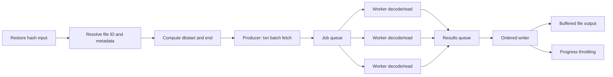
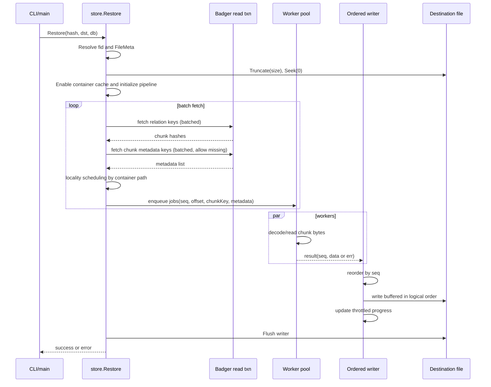
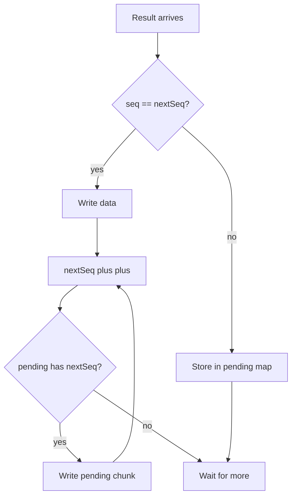
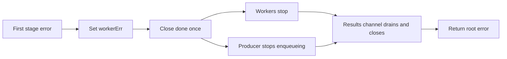

# Restore LLD

## Document Intent

This is the long-term Low Level Design document for the restore subsystem.

Primary goal:

- Explain how restore works today in enough detail that an engineer can safely
  operate, debug, and extend it years later.

Secondary goals:

- Capture design rationale behind performance changes.
- Document correctness invariants and failure behavior.
- Serve as a practical runbook for tuning and troubleshooting.

## Scope

In scope:

- Restore execution path in [lib/store/restore.go](lib/store/restore.go).
- Restore-related runtime tuning in [lib/cnst/const.go](lib/cnst/const.go) and
  [main.go](main.go).
- Data retrieval path used by restore in [lib/dbio/dbio.go](lib/dbio/dbio.go).
- Container read/cache behavior affecting restore in
  [lib/fio/container.go](lib/fio/container.go) and
  [lib/fio/container_cache.go](lib/fio/container_cache.go).

Out of scope:

- Ingest pipeline internals except where required for restore compatibility.
- Chunk size strategy changes (explicitly deferred).

## Current Status Matrix

Legend:

- Done: implemented in code and validated.
- Deferred: intentionally not part of this cycle.

| Feature / Optimization                                  | Status   | Priority | Notes                                                                     |
| ------------------------------------------------------- | -------- | -------- | ------------------------------------------------------------------------- |
| Baseline restore flow analysis and bottleneck mapping   | Done     | High     | This document is now aligned with current code behavior.                  |
| Buffered destination writer                             | Done     | High     | Uses configured write buffer size from restore tuning helpers.            |
| Progress update throttling                              | Done     | Medium   | Time-based plus byte threshold flushing to progress bar.                  |
| Destination preallocation                               | Done     | Medium   | Output file is truncated to logical size before write loop.               |
| Reusable relation and chunk key building                | Done     | High     | Prefix reuse and append-based key construction in producer path.          |
| AppendToBytesSlice allocation optimization              | Done     | High     | Updated in util to pre-size and append with typed fast paths.             |
| Single read transaction for metadata fetch              | Done     | High     | Metadata lookup is done in one Badger view transaction.                   |
| Batched metadata fetch                                  | Done     | Medium   | Relation and metadata are fetched in bounded batches.                     |
| Worker pipeline with ordered writer                     | Done     | High     | Parallel decode/read with deterministic ordered output.                   |
| Restore tuning flags                                    | Done     | Medium   | Worker, queue, progress interval, and write buffer are configurable.      |
| Container locality scheduling                           | Done     | Medium   | Producer clusters container-backed jobs by container path per batch.      |
| Ingest duplicate-ratio stats for adaptive restore cache | Deferred | Medium   | Persist total vs unique chunk counts per file to decide cache enablement. |
| Adaptive in-memory chunk metadata memoization           | Deferred | Medium   | Enable chunk-hash->metadata map only for high-duplicate files.            |

## Source Map

Core files and responsibilities:

- [lib/store/restore.go](lib/store/restore.go): restore orchestration, pipeline,
  ordering, progress, and cache setup.
- [lib/dbio/dbio.go](lib/dbio/dbio.go): node retrieval, chunk retrieval,
  metadata decode path.
- [lib/cnst/const.go](lib/cnst/const.go): restore tuning knobs and default
  bounds.
- [main.go](main.go): CLI flags for restore tuning and runtime wiring.
- [lib/fio/container.go](lib/fio/container.go): chunk read from container and
  decode path.
- [lib/fio/container_cache.go](lib/fio/container_cache.go): restore-time
  container read cache behavior.

## Glossary

- Evidence file: top-level stored object namespace E.
- Indexed/partition file: logical child objects inside evidence, namespaces I
  and P.
- Relation key: maps logical chunk offset to chunk hash, namespace R.
- Chunk key: maps chunk hash to stored chunk metadata, namespace C.
- Metadata-backed chunk: chunk location described in metadata payload.
- Hierarchical fallback: chunk key may not exist in DB and is looked up via
  block index path.

## Data Model and Keying

Namespaces used in restore-critical path (see
[lib/cnst/const.go](lib/cnst/const.go)):

- Relation namespace: R|||:
- Chunk namespace: C|||:
- Evidence namespace: E|||:
- Indexed namespace: I|||:
- Partition namespace: P|||:
- Data separator: |||

Restore metadata flow uses these mappings:

1. logical offset -> relation key -> chunk hash
2. chunk hash -> chunk key -> chunk metadata (when present)
3. metadata + range -> concrete bytes -> ordered file write

## High-Level Architecture

Important property:

- Throughput-oriented parallelism is isolated to read/decode stage.
- Output ordering remains strictly deterministic through sequence-indexed writer
  logic.

## End-to-End Sequence

## Detailed Flow Walkthrough

### 1. Entry and metadata resolution

Restore entry:

- Restore resolves the concrete file ID from provided hash.
- GetFileMeta computes Start, Size, EviHash for evidence/indexed/partition
  targets.
- Logical files validate evidence completion via checkCompleted.

Reasoning:

- Ensures restore never runs for incomplete evidence states.
- Preserves historical behavior and safety semantics.

### 2. Output file initialization

Current behavior:

- Preallocate exact logical size with truncate.
- Seek to start.
- Use buffered writer sized by restore tuning (GetRestoreWriteBufferSize).

Benefits:

- Lower write syscall frequency.
- Better filesystem locality on large outputs.

### 3. Producer path in one read transaction

Producer responsibilities:

- Iterate chunk-aligned offsets in bounded batches.
- Build relation keys with prebuilt prefix plus appended offset.
- Batch fetch chunk hashes.
- Batch fetch chunk metadata with missing-key tolerant variant.

Why missing-key tolerant metadata fetch exists:

- Hierarchical or block-index modes may not keep all chunk metadata entries in
  DB.
- Missing metadata does not imply missing chunk bytes.

### 4. Container-locality scheduling

Per batch, producer computes an emission order:

- Decode metadata payload for container-backed chunks.
- Group jobs by container path.
- Emit grouped container jobs first, then non-container jobs.

Key correctness detail:

- Job dispatch order can differ from logical offset order.
- Each job carries immutable logical sequence ID.
- Ordered writer enforces final output ordering by sequence.

Expected effect:

- Better reuse in container cache and reduced random container switching.

### 5. Worker pool

Worker responsibilities:

- For each job, retrieve chunk data with one of two paths:
  - metadata-backed path via GetChonkDataWithMetadata
  - fallback path via GetChonkData when metadata is missing
- Return seq, data, err to result channel.

Notes:

- Worker count and queue depth come from restore tuning helpers.
- On first error, cancellation signal stops further work.

### 6. Ordered writer

Writer responsibilities:

- Maintain nextSeq and out-of-order pending map.
- Write only contiguous sequence data to destination buffer.
- Drain pending map as sequence gaps close.
- Update progress bar on byte threshold or time interval.

Pipeline completion checks:

- Error short-circuits return path.
- Final guard verifies written sequence count equals producer total.

## Invariants and Correctness Guarantees

The restore implementation is built around these invariants:

1. Output order invariant

- Bytes are written strictly by logical chunk sequence, never by worker
  completion order.

2. Logical range invariant

- First and last chunk trimming behavior remains delegated to dbio chunk-data
  functions, preserving existing range semantics.

3. Metadata compatibility invariant

- Missing metadata entries are tolerated and fallback path is attempted,
  preserving hierarchical compatibility.

4. Incomplete evidence invariant

- Restore refuses incomplete evidence through established file-meta checks.

5. Cache lifecycle invariant

- Container read cache is enabled for restore duration and always disabled on
  return path.

## Runtime Tuning and CLI

Restore tuning flags are wired through [main.go](main.go) to
[lib/cnst/const.go](lib/cnst/const.go):

- --restore-workers
- --restore-queue
- --restore-progress-ms
- --restore-buffer-mb

Default policy summary:

- workers: adaptive from CPU with safe floor and cap.
- queue: multiple of workers with floor constraint.
- progress interval: bounded window to avoid overly chatty updates.
- write buffer: bounded MB range with sensible default.

Operational guidance:

- Start with defaults.
- Increase workers only while storage and CPU both have headroom.
- Increase queue if workers appear underfed.
- Increase buffer for large sequential restores on high-latency filesystems.

## Error Handling Model

Error sources:

- Key lookup failures in producer.
- Decode/read failures in worker stage.
- Destination write/flush failures.
- Pipeline consistency mismatch.

Behavior:

- First observed failure triggers cancellation signal.
- Workers terminate quickly via done channel.
- Producer stops enqueuing when cancellation is observed.
- Caller receives concrete root failure.

## Performance Characteristics

Current dominant costs:

- Chunk read and decode from storage path.
- DB key lookup for relation and metadata retrieval.
- Destination I/O bandwidth.

Implemented accelerators:

- Reduced per-chunk allocations in key build path.
- Batched metadata fetch under single transaction.
- Parallel chunk decode/read via worker pool.
- Buffered ordered writes.
- Container-locality scheduling for cache-friendlier read patterns.

## Diagrams for Maintenance

### Writer ordering logic

### Cancellation behavior

## Troubleshooting Guide

Symptom: restore fails with key-not-found for chunk metadata

- Expected in some hierarchical layouts.
- Ensure fallback path is active and chunk key resolution succeeds.

Symptom: high CPU but low disk throughput

- Reduce workers.
- Validate compression and encryption mode interactions.

Symptom: low CPU and low throughput

- Increase workers and queue gradually.
- Verify storage path and container cache sizing.

Symptom: progress updates appear bursty

- This is expected due to progress throttling.
- Adjust --restore-progress-ms if operator feedback needs differ.

## Backward and Mode Compatibility

Supported restore modes:

- standard metadata-backed chunk retrieval.
- hierarchical/block-index compatible retrieval with metadata-missing fallback.
- container and non-container storage paths.

Compatibility principle:

- Restore prioritizes successful byte reconstruction over strict metadata
  presence assumptions.

## Security and Safety Notes

- Decrypt/decompress path is delegated to existing fio/dbio routines.
- Restore writes through temp-file flow at CLI level before target replacement.
- Incomplete evidence restore is blocked early.

## Deferred and Future Work

Deferred by explicit decision:

- chunk size tuning changes.

Pinned for later revisit:

- ingest-time duplicate vs unique chunk accounting per file object.
- restore-time adaptive chunk metadata memoization keyed by chunk hash.

### Deferred Design Note: Duplicate Ratio Guided Cache Enablement

Context:

- Restore currently uses batched lookups, a single read transaction, worker
  pipeline, and container-locality scheduling.
- A proposed additional optimization is a per-restore in-memory map: chunk-hash
  -> chunk metadata (or missing sentinel).

Problem this solves:

- Metadata lookups for repeated chunk hashes can be avoided after first fetch.
- This primarily helps highly deduplicated files.

Proposed decision signal:

- Persist per-file ingest stats:
  - total_chunks = N
  - unique_chunks = U
  - duplicate_ratio = 1 - U/N
- Enable metadata memoization only when duplicate_ratio crosses a threshold
  (suggested initial range: 0.15 to 0.25).

Expected performance envelope:

- Saved metadata fetch opportunities are approximately N - U.
- End-to-end restore improvement depends on how much time is spent in metadata
  lookup vs read/decode I/O.
- Typical expected gain range: low single-digit % to ~20% on highly repetitive
  datasets; near-zero on mostly unique datasets.

Store-path impact expectation:

- Small additional ingest overhead if implemented as in-memory counters/set per
  file and persisted once at finalize.
- Avoid per-chunk extra DB writes.
- For very large files, consider bounded-memory strategy (e.g., approximate
  cardinality) to keep memory stable.

Revisit trigger:

- Prioritize implementation when profiling shows metadata lookup is a material
  restore bottleneck and duplicate_ratio is frequently above threshold in real
  workloads.

Possible future enhancements:

- richer per-stage metrics emission for live observability.
- adaptive worker auto-tuning from runtime feedback.
- optional locality heuristics beyond container path grouping.

## Validation Checklist

When changing restore code, verify all of these:

1. Unit and package tests pass for store/util/cli.
2. Hierarchical roundtrip restore path passes.
3. Output bytes match source logical bytes for evidence/indexed/partition cases.
4. Ordered writer still enforces deterministic output under high concurrency.
5. Cancellation and error propagation are not regressed.

## Quick Handoff Summary

Restore is now a staged, high-throughput pipeline with strict ordered output
semantics.

The most important mental model:

- Producer resolves what to read.
- Workers fetch and decode in parallel.
- Writer serializes final output by sequence.

If this model stays intact, performance and correctness stay aligned.
